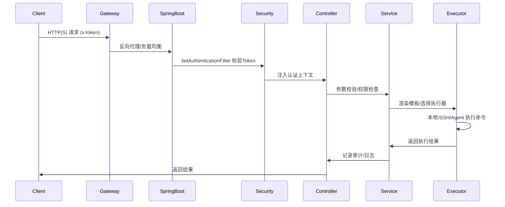

# HttpRun Java 企业级架构说明文档

## 项目简介

HttpRun 是一款面向企业的安全 Shell 命令网关，支持通过 RESTful API 或 Web UI 远程安全执行预定义命令，具备细粒度权限、审批、审计、监控等特性。Java 版本基于 Spring Boot 3.2.x，适合中大型企业安全运维自动化场景。

项目地址：[https://github.com/paul-yangmy/httprun-java](https://github.com/paul-yangmy/httprun-java)

---

## 技术栈

**后端：**
- Java 17 / 21 LTS
- Spring Boot 3.2.x / Spring Security 6.x / Spring Data JPA / Hibernate 6.x
- MySQL 8.0+ / Redis 7.x
- JWT (jjwt) / OpenAPI (SpringDoc)
- JSch（SSH 远程执行）/ Bouncycastle（密钥处理）
- Flyway / Caffeine / Lombok / MapStruct
- AES-GCM 256位（敏感信息加密）
- Micrometer + Prometheus + Grafana（监控）
- Logback（结构化日志）

**前端：**
- React 18 / TypeScript 4.9 / Ant Design 5 / UmiJS / Monaco Editor

**运维与部署：**
- Docker 多阶段构建、docker-compose 一键部署
- 健康检查、Prometheus 指标、结构化审计日志

---

## 目录结构（核心）

```
httprun-java/
├── pom.xml                  # Maven 配置
├── src/
│   ├── main/
│   │   ├── java/com/httprun/
│   │   │   ├── HttpRunApplication.java
│   │   │   ├── config/      # 配置类（安全、JWT、Swagger、异步等）
│   │   │   ├── controller/  # API 控制器（Admin/User/Auth/Health）
│   │   │   ├── service/     # 业务服务与实现
│   │   │   ├── repository/  # JPA 数据访问
│   │   │   ├── entity/      # 实体类（Command/Token/AccessLog/...）
│   │   │   ├── executor/    # 命令执行引擎（本地/SSH/模板/安全/凭证加密）
│   │   │   ├── security/    # JWT、权限、IP白名单等安全模块
│   │   │   ├── aspect/      # 日志、权限、审计切面
│   │   │   ├── exception/   # 异常处理
│   │   │   ├── enums/       # 枚举
│   │   │   ├── util/        # 工具类（CryptoUtils 加密/解密）
│   │   │   ├── exception/   # 全局异常
│   │   │   └── enums/       # 枚举
│   │   └── resources/
│   │       ├── application.yml / application-prod.yml
│   │       ├── db/migration/ # Flyway SQL 脚本
│   │       └── logback-spring.xml
│   └── test/java/com/httprun/ # 单元测试
├── webapp/                  # React 前端（Ant Design Pro）
├── docker/
│   ├── Dockerfile
│   └── docker-compose.yml
└── docs/                    # 文档
```

---

## 关键架构与核心流程

### 1. API 到命令执行全链路



### 2. 安全与权限

- JWT 鉴权 + Token 黑名单 + 指纹绑定
- RBAC 角色权限模型（支持命令级授权）
- 命令参数多层校验（类型/长度/危险字符/正则/白名单）
- IP 白名单、审批流、操作审计

### 3. 命令执行引擎

- 支持本地（ProcessBuilder）、SSH（JSch）、Agent（预留）三种模式
- **SSH 认证机制（三级优先级）：**
  1. 指定私钥（remoteConfig.privateKey，AES-GCM 解密）
  2. 系统默认 SSH 密钥（~/.ssh/id_rsa、id_ed25519 等，免密登录）
  3. 密码认证（remoteConfig.password，AES-GCM 解密）
- **SSH 凭证安全：**
  - 数据库存储密码和私钥时自动使用 AES-GCM 256位加密（ENC: 前缀标识）
  - 执行前自动识别和解密加密的凭证
  - API 返回时自动脱敏为 "****** "（6个星号）
- 命令模板渲染（{{.var}}）、参数安全校验、超时/并发/沙箱隔离
- 并发控制（Semaphore）、队列满异常、执行超时强杀

### 4. 执行历史与访问日志

- **智能日志记录**: 访问日志切面自动过滤 GET 查询请求，只记录修改类操作（POST/PUT/DELETE）和命令执行
- **执行历史管理**: 
  - 服务端统一存储执行历史，前端不再使用 localStorage
  - 支持多条件筛选：Token、命令名、状态、时间范围、关键词搜索
  - 支持分页查询、单条删除、批量删除、清空个人记录
  - 管理员可查看所有用户的执行历史，普通用户只能查看自己的记录
- **日志类型筛选**: 访问日志支持按类型筛选（仅命令执行 / 全部请求）
- **字段命名规范**: API 返回数据统一使用驼峰命名（tokenId、commandName、statusCode 等）

### 5. 审批与审计

- 支持命令审批流（PENDING→APPROVED/REJECTED→EXECUTED）
- 审批、执行、操作全链路结构化审计日志（Logback JSON）
- 审批/执行通知机制（可扩展钉钉/邮件等）

### 6. 监控与可观测性

- Micrometer + Prometheus + Grafana 监控命令执行、Token、审批等指标
- /actuator/health、/actuator/prometheus 健康与指标端点
- 结构化日志、审计日志、命令审计分离

---

## 配置与部署

### application.yml 关键配置

```yaml
server:
    port: 8081
spring:
    datasource:
        url: jdbc:mysql://${DB_HOST:localhost}:${DB_PORT:3306}/httprun?useUnicode=true&characterEncoding=utf8&useSSL=false&serverTimezone=Asia/Shanghai
        username: ${DB_USER:root}
        password: ${DB_PASSWORD:root}
        driver-class-name: com.mysql.cj.jdbc.Driver
    data:
        redis:
            host: ${REDIS_HOST:localhost}
            port: ${REDIS_PORT:6379}
            password: ${REDIS_PASSWORD:}
    flyway:
        enabled: true
        locations: classpath:db/migration
jwt:
    secret: ${JWT_SECRET:your-256-bit-secret-key-here-at-least-32-characters}
    expiration: 86400000
command:
    executor:
        max-concurrent: 10
        default-timeout: 30
        max-timeout: 300
```

### Docker 部署

```dockerfile
# 多阶段构建
FROM maven:3.9-eclipse-temurin-17 AS builder
WORKDIR /app
COPY pom.xml .
RUN mvn dependency:go-offline
COPY src ./src
RUN mvn package -DskipTests
FROM eclipse-temurin:17-jre-alpine
RUN apk --no-cache add curl bash
WORKDIR /app
COPY --from=builder /app/target/*.jar app.jar
COPY webapp/build ./webapp/build
HEALTHCHECK --interval=30s --timeout=3s --start-period=30s --retries=3 \
        CMD curl -f http://localhost:8081/api/health || exit 1
EXPOSE 8081
ENTRYPOINT ["java", "-Xms256m", "-Xmx512m", "-jar", "app.jar"]
```

```yaml
# docker-compose.yml
version: '3.8'
services:
    httprun:
        build: .
        ports:
            - "8081:8081"
        environment:
            - SPRING_PROFILES_ACTIVE=prod
            - DB_HOST=mysql
            - DB_PORT=3306
            - DB_USER=httprun
            - DB_PASSWORD=httprun123
            - REDIS_HOST=redis
            - JWT_SECRET=your-super-secret-key-at-least-32-characters
        depends_on:
            mysql:
                condition: service_healthy
            redis:
                condition: service_started
        restart: unless-stopped
    mysql:
        image: mysql:8.0
        environment:
            - MYSQL_ROOT_PASSWORD=root123
            - MYSQL_DATABASE=httprun
            - MYSQL_USER=httprun
            - MYSQL_PASSWORD=httprun123
        volumes:
            - mysql_data:/var/lib/mysql
        healthcheck:
            test: ["CMD", "mysqladmin", "ping", "-h", "localhost"]
            interval: 10s
            timeout: 5s
            retries: 5
        restart: unless-stopped
    redis:
        image: redis:7-alpine
        volumes:
            - redis_data:/data
        restart: unless-stopped
volumes:
    mysql_data:
    redis_data:
```

---

## 参考与开源

- Spring Boot 官方文档：https://docs.spring.io/spring-boot/docs/current/reference/html/
- Spring Security：https://docs.spring.io/spring-security/reference/index.html
- Spring Data JPA：https://docs.spring.io/spring-data/jpa/docs/current/reference/html/
- JJWT：https://github.com/jwtk/jjwt
- SpringDoc OpenAPI：https://springdoc.org/
- Flyway：https://flywaydb.org/documentation/
- Micrometer：https://micrometer.io/docs
- Prometheus：https://prometheus.io/docs/
- Grafana：https://grafana.com/docs/
- 项目地址：https://github.com/paul-yangmy/httprun-java

---

## 系统架构图

```
┌─────────────────────────────────────────────────────────────────────────────────┐
│                                   客户端层                                       │
│   ┌─────────────────┐    ┌─────────────────┐    ┌─────────────────┐            │
│   │    Web UI       │    │   REST Client   │    │   cURL/脚本      │            │
│   │  (React App)    │    │   (Postman等)    │    │                 │            │
│   └────────┬────────┘    └────────┬────────┘    └────────┬────────┘            │
└────────────┼─────────────────────┼─────────────────────┼────────────────────────┘
             │                     │                     │
             └─────────────────────┴─────────────────────┘
                                   │ HTTPS/REST API
                                   ▼
┌─────────────────────────────────────────────────────────────────────────────────┐
│                            Nginx / Spring Cloud Gateway                          │
│                         (负载均衡 / SSL 终止 / 限流)                              │
└─────────────────────────────────────────────────────────────────────────────────┘
                                   │
                                   ▼
┌─────────────────────────────────────────────────────────────────────────────────┐
│                          Spring Boot Application                                 │
│  ┌───────────────────────────────────────────────────────────────────────────┐ │
│  │                        Spring Security Filter Chain                        │ │
│  │   ┌─────────────┐ ┌─────────────┐ ┌─────────────┐ ┌─────────────┐        │ │
│  │   │   CORS      │→│   JWT       │→│ Authorization│→│  Exception  │        │ │
│  │   │   Filter    │ │   Filter    │ │   Filter    │ │   Handler   │        │ │
│  │   └─────────────┘ └─────────────┘ └─────────────┘ └─────────────┘        │ │
│  └───────────────────────────────────────────────────────────────────────────┘ │
│                                      │                                          │
│  ┌───────────────────────────────────┴───────────────────────────────────────┐ │
│  │                           Controller Layer                                 │ │
│  │  ┌─────────────────┐  ┌─────────────────┐  ┌─────────────────┐           │ │
│  │  │ UserController  │  │ AdminController │  │ AuthController  │           │ │
│  │  │ /api/run/*      │  │ /api/admin/*    │  │ /api/auth/*     │           │ │
│  │  └─────────────────┘  └─────────────────┘  └─────────────────┘           │ │
│  └───────────────────────────────────────────────────────────────────────────┘ │
│                                      │                                          │
│  ┌───────────────────────────────────┴───────────────────────────────────────┐ │
│  │                            Service Layer                                   │ │
│  │  ┌──────────────┐  ┌──────────────┐  ┌──────────────┐  ┌──────────────┐  │ │
│  │  │ CommandSvc   │  │   JwtSvc     │  │ AccessLogSvc │  │  TokenSvc    │  │ │
│  │  └──────────────┘  └──────────────┘  └──────────────┘  └──────────────┘  │ │
│  └───────────────────────────────────────────────────────────────────────────┘ │
│                                      │                                          │
│  ┌───────────────────────────────────┴───────────────────────────────────────┐ │
│  │                         Command Executor Engine                            │ │
│  │  ┌─────────────────┐  ┌─────────────────┐  ┌─────────────────┐           │ │
│  │  │ LocalExecutor   │  │  SshExecutor    │  │  AgentExecutor  │           │ │
│  │  │ (ProcessBuilder)│  │  (JSch/SSHJ)    │  │  (gRPC Client)  │           │ │
│  │  └─────────────────┘  └─────────────────┘  └─────────────────┘           │ │
│  └───────────────────────────────────────────────────────────────────────────┘ │
│                                      │                                          │
│  ┌───────────────────────────────────┴───────────────────────────────────────┐ │
│  │                          Repository Layer                                  │ │
│  │  ┌──────────────┐  ┌──────────────┐  ┌──────────────┐                    │ │
│  │  │ CommandRepo  │  │  TokenRepo   │  │ AccessLogRepo│                    │ │
│  │  │ (JPA)        │  │  (JPA)       │  │ (JPA)        │                    │ │
│  │  └──────────────┘  └──────────────┘  └──────────────┘                    │ │
│  └───────────────────────────────────────────────────────────────────────────┘ │
└─────────────────────────────────────────────────────────────────────────────────┘
                                      │
          ┌───────────────────────────┼───────────────────────────┐
          │                           │                           │
          ▼                           ▼                           ▼
┌─────────────────┐         ┌─────────────────┐         ┌─────────────────┐
│     MySQL       │         │     Redis       │         │   Nacos/Consul  │
│   (主数据库)     │         │  (缓存/会话)     │         │   (配置中心)     │
│  ┌───────────┐  │         │  ┌───────────┐  │         │                 │
│  │ commands  │  │         │  │ token:    │  │         │                 │
│  │ tokens    │  │         │  │ blacklist │  │         │                 │
│  │ access_   │  │         │  │ cache:    │  │         │                 │
│  │ logs      │  │         │  │ commands  │  │         │                 │
│  └───────────┘  │         │  └───────────┘  │         │                 │
└─────────────────┘         └─────────────────┘         └─────────────────┘
```

---

## 核心模块实现

### 1. 启动类

```java
package com.httprun;

import org.springframework.boot.SpringApplication;
import org.springframework.boot.autoconfigure.SpringBootApplication;
import org.springframework.scheduling.annotation.EnableAsync;
import org.springframework.scheduling.annotation.EnableScheduling;

@SpringBootApplication
@EnableAsync
@EnableScheduling
public class HttpRunApplication {
    public static void main(String[] args) {
        SpringApplication.run(HttpRunApplication.class, args);
    }
}
```

---

### 2. 实体类定义

#### Command 实体

```java
package com.httprun.entity;

import com.httprun.enums.CommandStatus;
import com.httprun.enums.ExecutionMode;
import jakarta.persistence.*;
import lombok.Data;
import org.hibernate.annotations.JdbcTypeCode;
import org.hibernate.type.SqlTypes;

import java.time.LocalDateTime;

@Data
@Entity
@Table(name = "commands", indexes = {
    @Index(name = "idx_command_name", columnList = "name", unique = true),
    @Index(name = "idx_command_status", columnList = "status")
})
public class Command {
    
    @Id
    @GeneratedValue(strategy = GenerationType.IDENTITY)
    private Long id;
    
    @Column(nullable = false, unique = true, length = 100)
    private String name;
    
    @Column(unique = true, length = 200)
    private String path;
    
    @Column(length = 500)
    private String description;
    
    @Enumerated(EnumType.STRING)
    @Column(nullable = false, length = 20)
    private CommandStatus status = CommandStatus.ACTIVE;
    
    /**
     * 命令配置 JSON，包含：
     * - command: 命令模板
     * - params: 参数定义列表
     * - env: 环境变量列表
     */
    @JdbcTypeCode(SqlTypes.JSON)
    @Column(columnDefinition = "JSON")
    private CommandConfig commandConfig;
    
    /**
     * 执行模式：LOCAL, SSH, AGENT
     */
    @Enumerated(EnumType.STRING)
    @Column(length = 20)
    private ExecutionMode executionMode = ExecutionMode.LOCAL;
    
    /**
     * 远程执行配置（SSH/Agent 模式使用）
     */
    @JdbcTypeCode(SqlTypes.JSON)
    @Column(columnDefinition = "JSON")
    private RemoteConfig remoteConfig;
    
    /**
     * 命令分组
     */
    @Column(length = 50)
    private String groupName;
    
    /**
     * 标签（逗号分隔）
     */
    @Column(length = 200)
    private String tags;
    
    /**
     * 执行超时时间（秒）
     */
    @Column
    private Integer timeoutSeconds = 30;
    
    @Column(nullable = false, updatable = false)
    private LocalDateTime createdAt;
    
    @Column(nullable = false)
    private LocalDateTime updatedAt;
    
    @PrePersist
    protected void onCreate() {
        createdAt = LocalDateTime.now();
        updatedAt = LocalDateTime.now();
    }
    
    @PreUpdate
    protected void onUpdate() {
        updatedAt = LocalDateTime.now();
    }
}

/**
 * 命令配置（存储为 JSON）
 */
@Data
class CommandConfig {
    private String command;              // 命令模板
    private List<ParamDefine> params;    // 参数定义
    private List<EnvVar> env;            // 环境变量
}

@Data
class ParamDefine {
    private String name;
    private String description;
    private String type;          // string, integer, boolean
    private Object defaultValue;
    private boolean required;
}

@Data
class EnvVar {
    private String name;
    private String value;
}

@Data
class RemoteConfig {
    private String host;
    private Integer port;
    private String username;
    private Long sshKeyId;        // SSH 密钥 ID
    private String agentId;       // Agent 标识
}
```

#### Token 实体

```java
package com.httprun.entity;

import jakarta.persistence.*;
import lombok.Data;

import java.time.LocalDateTime;

@Data
@Entity
@Table(name = "tokens", indexes = {
    @Index(name = "idx_token_name", columnList = "name"),
    @Index(name = "idx_token_jwt", columnList = "jwtToken", unique = true)
})
public class Token {
    
    @Id
    @GeneratedValue(strategy = GenerationType.IDENTITY)
    private Long id;
    
    /**
     * 授权的命令列表（逗号分隔）
     */
    @Column(nullable = false, length = 1000)
    private String subject;
    
    /**
     * 用户名/Token 名称
     */
    @Column(nullable = false, length = 100)
    private String name;
    
    /**
     * 是否管理员
     */
    @Column(nullable = false)
    private Boolean isAdmin = false;
    
    /**
     * 签发时间（Unix 时间戳）
     */
    @Column(nullable = false)
    private Long issuedAt;
    
    /**
     * 过期时间（Unix 时间戳）
     */
    @Column(nullable = false)
    private Long expiresAt;
    
    /**
     * JWT Token 字符串
     */
    @Column(nullable = false, columnDefinition = "TEXT")
    private String jwtToken;
    
    /**
     * Token 是否被撤销
     */
    @Column(nullable = false)
    private Boolean revoked = false;
    
    @Column(nullable = false, updatable = false)
    private LocalDateTime createdAt;
    
    @Column(nullable = false)
    private LocalDateTime updatedAt;
    
    @PrePersist
    protected void onCreate() {
        createdAt = LocalDateTime.now();
        updatedAt = LocalDateTime.now();
    }
    
    @PreUpdate
    protected void onUpdate() {
        updatedAt = LocalDateTime.now();
    }
}
```

#### AccessLog 实体

```java
package com.httprun.entity;

import jakarta.persistence.*;
import lombok.Data;

import java.time.LocalDateTime;

@Data
@Entity
@Table(name = "access_logs", indexes = {
    @Index(name = "idx_accesslog_token", columnList = "tokenId"),
    @Index(name = "idx_accesslog_path", columnList = "path"),
    @Index(name = "idx_accesslog_created", columnList = "createdAt")
})
public class AccessLog {
    
    @Id
    @GeneratedValue(strategy = GenerationType.IDENTITY)
    private Long id;
    
    @Column(length = 500)
    private String tokenId;
    
    @Column(nullable = false, length = 200)
    private String path;
    
    @Column(length = 50)
    private String ip;
    
    @Column(length = 20)
    private String method;
    
    @Column(columnDefinition = "TEXT")
    private String request;
    
    @Column(columnDefinition = "MEDIUMTEXT")
    private String response;
    
    /**
     * 响应状态码
     */
    @Column
    private Integer statusCode;
    
    /**
     * 执行耗时（毫秒）
     */
    @Column
    private Long duration;
    
    @Column(nullable = false, updatable = false)
    private LocalDateTime createdAt;
    
    @PrePersist
    protected void onCreate() {
        createdAt = LocalDateTime.now();
    }
}
```

---

### 3. 命令执行引擎

#### 执行器接口

```java
package com.httprun.executor;

import com.httprun.dto.request.RunCommandRequest;
import com.httprun.dto.response.CommandExecutionResult;

import java.util.concurrent.CompletableFuture;

/**
 * 命令执行器接口
 */
public interface CommandExecutor {
    
    /**
     * 同步执行命令
     */
    CommandExecutionResult execute(String command, RunCommandRequest request, int timeoutSeconds);
    
    /**
     * 异步执行命令
     */
    CompletableFuture<CommandExecutionResult> executeAsync(String command, RunCommandRequest request, int timeoutSeconds);
    
    /**
     * 检查执行器是否可用
     */
    boolean isAvailable();
}
```

#### 本地命令执行器（对应 Go 版本的 exec.CommandContext）

```java
package com.httprun.executor;

import com.httprun.dto.request.RunCommandRequest;
import com.httprun.dto.response.CommandExecutionResult;
import com.httprun.exception.CommandExecutionException;
import lombok.extern.slf4j.Slf4j;
import org.springframework.stereotype.Component;

import java.io.BufferedReader;
import java.io.InputStreamReader;
import java.util.ArrayList;
import java.util.List;
import java.util.Map;
import java.util.concurrent.*;
import java.util.stream.Collectors;

/**
 * 本地命令执行器
 * 
 * ⚠️ 重要说明：所有命令在 HttpRun 服务部署的机器上本地执行
 */
@Slf4j
@Component
public class LocalCommandExecutor implements CommandExecutor {
    
    private final ExecutorService executorService;
    private final Semaphore semaphore;  // 并发控制
    
    public LocalCommandExecutor() {
        // 最大并发执行数
        int maxConcurrent = 10;
        this.executorService = Executors.newFixedThreadPool(maxConcurrent);
        this.semaphore = new Semaphore(maxConcurrent);
    }
    
    @Override
    public CommandExecutionResult execute(String command, RunCommandRequest request, int timeoutSeconds) {
        // 尝试获取信号量
        boolean acquired = false;
        try {
            acquired = semaphore.tryAcquire(5, TimeUnit.SECONDS);
            if (!acquired) {
                return CommandExecutionResult.error("Execution queue full, please retry later");
            }
            
            return doExecute(command, request, timeoutSeconds);
            
        } catch (InterruptedException e) {
            Thread.currentThread().interrupt();
            return CommandExecutionResult.error("Execution interrupted");
        } finally {
            if (acquired) {
                semaphore.release();
            }
        }
    }
    
    private CommandExecutionResult doExecute(String command, RunCommandRequest request, int timeoutSeconds) {
        long startTime = System.currentTimeMillis();
        
        try {
            // 1. 解析命令为参数列表（类似 Go 的 shlex.Split）
            List<String> cmdArgs = parseCommand(command);
            log.info("Executing command: {}", cmdArgs);
            
            // 2. 构建进程（类似 Go 的 exec.CommandContext）
            ProcessBuilder processBuilder = new ProcessBuilder(cmdArgs);
            
            // 3. 注入环境变量（类似 Go 的 cmd.Env）
            Map<String, String> environment = processBuilder.environment();
            if (request.getEnv() != null) {
                for (var env : request.getEnv()) {
                    environment.put(env.getName(), env.getValue());
                }
            }
            
            // 4. 合并标准输出和错误输出
            processBuilder.redirectErrorStream(false);
            
            // 5. 启动进程
            Process process = processBuilder.start();
            
            // 6. 异步读取输出
            CompletableFuture<String> stdoutFuture = CompletableFuture.supplyAsync(() -> 
                readStream(process.getInputStream()), executorService);
            CompletableFuture<String> stderrFuture = CompletableFuture.supplyAsync(() -> 
                readStream(process.getErrorStream()), executorService);
            
            // 7. 等待进程完成（带超时）
            boolean finished = process.waitFor(timeoutSeconds, TimeUnit.SECONDS);
            
            if (!finished) {
                // 超时，强制终止进程（类似 Go 的 cmd.Process.Kill()）
                process.destroyForcibly();
                process.waitFor(5, TimeUnit.SECONDS);
                return CommandExecutionResult.builder()
                    .exitCode(-1)
                    .stderr("Command timeout after " + timeoutSeconds + " seconds")
                    .duration(System.currentTimeMillis() - startTime)
                    .build();
            }
            
            // 8. 获取输出
            String stdout = stdoutFuture.get(5, TimeUnit.SECONDS);
            String stderr = stderrFuture.get(5, TimeUnit.SECONDS);
            int exitCode = process.exitValue();
            
            return CommandExecutionResult.builder()
                .stdout(stdout)
                .stderr(stderr)
                .exitCode(exitCode)
                .duration(System.currentTimeMillis() - startTime)
                .build();
                
        } catch (Exception e) {
            log.error("Command execution failed", e);
            return CommandExecutionResult.builder()
                .error(e.getMessage())
                .duration(System.currentTimeMillis() - startTime)
                .build();
        }
    }
    
    @Override
    public CompletableFuture<CommandExecutionResult> executeAsync(String command, 
            RunCommandRequest request, int timeoutSeconds) {
        return CompletableFuture.supplyAsync(() -> 
            execute(command, request, timeoutSeconds), executorService);
    }
    
    /**
     * 解析命令字符串为参数列表
     * 类似 Go 的 shlex.Split
     */
    private List<String> parseCommand(String command) {
        List<String> args = new ArrayList<>();
        StringBuilder current = new StringBuilder();
        boolean inQuote = false;
        char quoteChar = 0;
        
        for (int i = 0; i < command.length(); i++) {
            char c = command.charAt(i);
            
            if (inQuote) {
                if (c == quoteChar) {
                    inQuote = false;
                } else {
                    current.append(c);
                }
            } else {
                if (c == '"' || c == '\'') {
                    inQuote = true;
                    quoteChar = c;
                } else if (Character.isWhitespace(c)) {
                    if (current.length() > 0) {
                        args.add(current.toString());
                        current = new StringBuilder();
                    }
                } else {
                    current.append(c);
                }
            }
        }
        
        if (current.length() > 0) {
            args.add(current.toString());
        }
        
        return args;
    }
    
    private String readStream(java.io.InputStream inputStream) {
        try (BufferedReader reader = new BufferedReader(new InputStreamReader(inputStream))) {
            return reader.lines().collect(Collectors.joining("\n"));
        } catch (Exception e) {
            return "";
        }
    }
    
    @Override
    public boolean isAvailable() {
        return true;
    }
}
```

#### 命令模板处理器（对应 Go 的 text/template）

```java
package com.httprun.executor;

import com.httprun.dto.request.RunCommandRequest;
import com.httprun.entity.Command;
import lombok.extern.slf4j.Slf4j;
import org.springframework.stereotype.Component;

import java.util.HashMap;
import java.util.Map;
import java.util.regex.Matcher;
import java.util.regex.Pattern;

/**
 * 命令模板处理器
 * 实现类似 Go text/template 的模板渲染功能
 */
@Slf4j
@Component
public class CommandTemplate {
    
    // 匹配 {{.variableName}} 格式的模板变量
    private static final Pattern TEMPLATE_PATTERN = Pattern.compile("\\{\\{\\s*\\.([a-zA-Z_][a-zA-Z0-9_]*)\\s*}}");
    
    /**
     * 渲染命令模板
     * 
     * 示例:
     *   模板: "ping {{.target}} -c {{.count}}"
     *   参数: {target: "google.com", count: 4}
     *   结果: "ping google.com -c 4"
     */
    public String render(Command command, RunCommandRequest request) {
        String template = command.getCommandConfig().getCommand();
        
        // 构建参数映射
        Map<String, Object> params = buildParamMap(command, request);
        
        // 渲染模板
        return renderTemplate(template, params);
    }
    
    private Map<String, Object> buildParamMap(Command command, RunCommandRequest request) {
        Map<String, Object> params = new HashMap<>();
        
        // 1. 先填充默认值
        if (command.getCommandConfig().getParams() != null) {
            for (var paramDef : command.getCommandConfig().getParams()) {
                if (paramDef.getDefaultValue() != null) {
                    params.put(paramDef.getName(), paramDef.getDefaultValue());
                }
            }
        }
        
        // 2. 用请求参数覆盖
        if (request.getParams() != null) {
            for (var param : request.getParams()) {
                if (param.getValue() != null) {
                    params.put(param.getName(), param.getValue());
                }
            }
        }
        
        return params;
    }
    
    private String renderTemplate(String template, Map<String, Object> params) {
        StringBuffer result = new StringBuffer();
        Matcher matcher = TEMPLATE_PATTERN.matcher(template);
        
        while (matcher.find()) {
            String varName = matcher.group(1);
            Object value = params.get(varName);
            String replacement = value != null ? String.valueOf(value) : "";
            matcher.appendReplacement(result, Matcher.quoteReplacement(replacement));
        }
        matcher.appendTail(result);
        
        return result.toString();
    }
    
    /**
     * 验证参数
     */
    public void validateParams(Command command, RunCommandRequest request) {
        if (command.getCommandConfig().getParams() == null) {
            return;
        }
        
        Map<String, Object> providedParams = new HashMap<>();
        if (request.getParams() != null) {
            for (var param : request.getParams()) {
                providedParams.put(param.getName(), param.getValue());
            }
        }
        
        for (var paramDef : command.getCommandConfig().getParams()) {
            if (paramDef.isRequired()) {
                Object value = providedParams.get(paramDef.getName());
                if (value == null || value.toString().isEmpty()) {
                    throw new IllegalArgumentException(
                        "Parameter '" + paramDef.getName() + "' is required");
                }
            }
            
            // 验证危险字符（防止命令注入）
            Object value = providedParams.get(paramDef.getName());
            if (value != null) {
                validateParamSecurity(paramDef.getName(), value.toString());
            }
        }
    }
    
    /**
     * 参数安全验证（防止命令注入）
     */
    private void validateParamSecurity(String name, String value) {
        String[] dangerousChars = {";", "|", "&", "`", "$", "(", ")", "{", "}", "<", ">", "\n", "\r"};
        
        for (String dangerous : dangerousChars) {
            if (value.contains(dangerous)) {
                throw new SecurityException(
                    "Parameter '" + name + "' contains dangerous character: " + dangerous);
            }
        }
    }
}
```

#### SSH 远程执行器

```java
package com.httprun.executor;

import com.httprun.dto.request.RunCommandRequest;
import com.httprun.dto.response.CommandExecutionResult;
import com.jcraft.jsch.*;
import lombok.extern.slf4j.Slf4j;
import org.springframework.stereotype.Component;

import java.io.ByteArrayOutputStream;
import java.util.concurrent.CompletableFuture;

/**
 * SSH 远程命令执行器
 */
@Slf4j
@Component
public class SshCommandExecutor implements CommandExecutor {
    
    @Override
    public CommandExecutionResult execute(String command, RunCommandRequest request, int timeoutSeconds) {
        var remoteConfig = request.getRemoteConfig();
        if (remoteConfig == null) {
            return CommandExecutionResult.error("Remote config is required for SSH execution");
        }
        
        long startTime = System.currentTimeMillis();
        Session session = null;
        ChannelExec channel = null;
        
        try {
            // 1. 创建 SSH 会话
            JSch jsch = new JSch();
            
            // 添加私钥认证
            if (remoteConfig.getPrivateKey() != null) {
                jsch.addIdentity("key", remoteConfig.getPrivateKey().getBytes(), null, null);
            }
            
            // 2. 建立连接
            session = jsch.getSession(
                remoteConfig.getUsername(),
                remoteConfig.getHost(),
                remoteConfig.getPort() != null ? remoteConfig.getPort() : 22
            );
            
            session.setConfig("StrictHostKeyChecking", "no");
            session.setTimeout(timeoutSeconds * 1000);
            session.connect();
            
            // 3. 执行命令
            channel = (ChannelExec) session.openChannel("exec");
            channel.setCommand(command);
            
            ByteArrayOutputStream stdout = new ByteArrayOutputStream();
            ByteArrayOutputStream stderr = new ByteArrayOutputStream();
            channel.setOutputStream(stdout);
            channel.setErrStream(stderr);
            
            channel.connect();
            
            // 4. 等待命令完成
            while (!channel.isClosed()) {
                Thread.sleep(100);
            }
            
            int exitCode = channel.getExitStatus();
            
            return CommandExecutionResult.builder()
                .stdout(stdout.toString())
                .stderr(stderr.toString())
                .exitCode(exitCode)
                .duration(System.currentTimeMillis() - startTime)
                .build();
                
        } catch (Exception e) {
            log.error("SSH execution failed", e);
            return CommandExecutionResult.builder()
                .error(e.getMessage())
                .duration(System.currentTimeMillis() - startTime)
                .build();
        } finally {
            if (channel != null) channel.disconnect();
            if (session != null) session.disconnect();
        }
    }
    
    @Override
    public CompletableFuture<CommandExecutionResult> executeAsync(String command, 
            RunCommandRequest request, int timeoutSeconds) {
        return CompletableFuture.supplyAsync(() -> execute(command, request, timeoutSeconds));
    }
    
    @Override
    public boolean isAvailable() {
        return true;
    }
}
```

---

### 3.3 SSH 凭证加密工具（CryptoUtils）

```java
package com.httprun.util;

import javax.crypto.Cipher;
import javax.crypto.KeyGenerator;
import javax.crypto.SecretKey;
import javax.crypto.spec.GCMParameterSpec;
import javax.crypto.spec.SecretKeySpec;
import java.security.SecureRandom;
import java.util.Base64;

/**
 * AES-GCM 256位加密工具
 * 
 * 用途：
 * - 加密 SSH 密码和私钥，保护敏感信息存储在数据库
 * - 自动识别加密标志（ENC: 前缀），执行时自动解密
 * - API 返回时自动脱敏敏感字段
 * 
 * 密钥管理：
 * - 从 application.properties 读取：httprun.crypto.secret-key
 * - 默认 32 字节密钥，支持自定义环境变量覆盖
 * 
 * 加密格式：
 * - ENC: + Base64(IV(16字节) + 密文)
 * - GCM 模式确保数据完整性和认证
 */
@Slf4j
public class CryptoUtils {
    
    private static final String ALGORITHM = "AES";
    private static final String CIPHER = "AES/GCM/NoPadding";
    private static final int KEY_SIZE = 256;
    private static final int GCM_TAG_LENGTH = 128;
    private static final int IV_LENGTH = 16;
    private static final String ENC_PREFIX = "ENC:";
    
    private final SecretKey secretKey;
    
    public CryptoUtils(String secretKeyStr) {
        byte[] decodedKey = Base64.getDecoder().decode(secretKeyStr);
        this.secretKey = new SecretKeySpec(decodedKey, 0, decodedKey.length, ALGORITHM);
    }
    
    /**
     * 加密敏感数据
     * @return ENC: 前缀 + Base64 加密数据
     */
    public String encrypt(String plaintext) {
        try {
            Cipher cipher = Cipher.getInstance(CIPHER);
            byte[] iv = new byte[IV_LENGTH];
            new SecureRandom().nextBytes(iv);
            GCMParameterSpec spec = new GCMParameterSpec(GCM_TAG_LENGTH, iv);
            
            cipher.init(Cipher.ENCRYPT_MODE, secretKey, spec);
            byte[] ciphertext = cipher.doFinal(plaintext.getBytes());
            
            // IV + 密文合并后 Base64 编码
            byte[] encrypted = new byte[IV_LENGTH + ciphertext.length];
            System.arraycopy(iv, 0, encrypted, 0, IV_LENGTH);
            System.arraycopy(ciphertext, 0, encrypted, IV_LENGTH, ciphertext.length);
            
            return ENC_PREFIX + Base64.getEncoder().encodeToString(encrypted);
        } catch (Exception e) {
            throw new RuntimeException("Encryption failed", e);
        }
    }
    
    /**
     * 解密敏感数据
     * @param ciphertext 带 ENC: 前缀的加密数据
     * @return 原始明文
     */
    public String decrypt(String ciphertext) {
        try {
            if (!ciphertext.startsWith(ENC_PREFIX)) {
                return ciphertext;  // 未加密数据，直接返回
            }
            
            String encData = ciphertext.substring(ENC_PREFIX.length());
            byte[] encrypted = Base64.getDecoder().decode(encData);
            
            byte[] iv = new byte[IV_LENGTH];
            System.arraycopy(encrypted, 0, iv, 0, IV_LENGTH);
            
            Cipher cipher = Cipher.getInstance(CIPHER);
            GCMParameterSpec spec = new GCMParameterSpec(GCM_TAG_LENGTH, iv);
            cipher.init(Cipher.DECRYPT_MODE, secretKey, spec);
            
            byte[] plaintext = cipher.doFinal(encrypted, IV_LENGTH, encrypted.length - IV_LENGTH);
            return new String(plaintext);
        } catch (Exception e) {
            throw new RuntimeException("Decryption failed", e);
        }
    }
    
    /**
     * 判断数据是否已加密
     */
    public boolean isEncrypted(String data) {
        return data != null && data.startsWith(ENC_PREFIX);
    }
}
```

**使用示例（SshCommandExecutor）：**

```java
// 在 execute() 执行前，解密 SSH 凭证
if (remoteConfig.getPrivateKey() != null && cryptoUtils.isEncrypted(remoteConfig.getPrivateKey())) {
    String decryptedKey = cryptoUtils.decrypt(remoteConfig.getPrivateKey());
    jsch.addIdentity("key", decryptedKey.getBytes(), null, null);
    log.debug("SSH private key decrypted for execution");
} else {
    jsch.addIdentity("key", remoteConfig.getPrivateKey().getBytes(), null, null);
}

// 密码认证
if (remoteConfig.getPassword() != null && cryptoUtils.isEncrypted(remoteConfig.getPassword())) {
    String decryptedPassword = cryptoUtils.decrypt(remoteConfig.getPassword());
    session.setPassword(decryptedPassword);
} else {
    session.setPassword(remoteConfig.getPassword());
}
```

**使用示例（CommandServiceImpl）：**

```java
// 创建/更新命令时自动加密
public void encryptRemoteConfig(Command command) {
    if (command.getRemoteConfig() == null) return;
    RemoteConfig config = command.getRemoteConfig();
    
    if (config.getPassword() != null && !cryptoUtils.isEncrypted(config.getPassword())) {
        config.setPassword(cryptoUtils.encrypt(config.getPassword()));
    }
    
    if (config.getPrivateKey() != null && !cryptoUtils.isEncrypted(config.getPrivateKey())) {
        config.setPrivateKey(cryptoUtils.encrypt(config.getPrivateKey()));
    }
}

// 返回给前端时自动脱敏
public void maskRemoteConfig(CommandResponse response) {
    if (response.getRemoteConfig() == null) return;
    RemoteConfig config = response.getRemoteConfig();
    
    if (config.getPassword() != null) {
        config.setPassword("******");
    }
    
    if (config.getPrivateKey() != null) {
        config.setPrivateKey("******");
    }
}
```

---

### 4. 服务层实现

#### CommandService 接口

```java
package com.httprun.service;

import com.httprun.dto.request.CreateCommandRequest;
import com.httprun.dto.request.RunCommandRequest;
import com.httprun.dto.response.CommandExecutionResult;
import com.httprun.dto.response.CommandResponse;
import com.httprun.dto.response.PageResponse;

import java.util.List;

public interface CommandService {
    
    CommandResponse createCommand(CreateCommandRequest request);
    
    List<CommandResponse> listCommands(List<String> names);
    
    List<CommandResponse> listAllCommands();
    
    void updateCommandStatus(List<String> names, String status);
    
    void deleteCommands(List<String> names);
    
    CommandExecutionResult runCommand(RunCommandRequest request, String tokenSubject);
}
```

#### CommandService 实现

```java
package com.httprun.service.impl;

import com.httprun.dto.request.CreateCommandRequest;
import com.httprun.dto.request.RunCommandRequest;
import com.httprun.dto.response.CommandExecutionResult;
import com.httprun.dto.response.CommandResponse;
import com.httprun.entity.Command;
import com.httprun.enums.CommandStatus;
import com.httprun.enums.ExecutionMode;
import com.httprun.exception.BusinessException;
import com.httprun.executor.CommandExecutor;
import com.httprun.executor.CommandTemplate;
import com.httprun.executor.LocalCommandExecutor;
import com.httprun.executor.SshCommandExecutor;
import com.httprun.repository.CommandRepository;
import com.httprun.service.CommandService;
import lombok.RequiredArgsConstructor;
import lombok.extern.slf4j.Slf4j;
import org.springframework.cache.annotation.CacheEvict;
import org.springframework.cache.annotation.Cacheable;
import org.springframework.stereotype.Service;
import org.springframework.transaction.annotation.Transactional;

import java.util.Arrays;
import java.util.List;
import java.util.stream.Collectors;

@Slf4j
@Service
@RequiredArgsConstructor
public class CommandServiceImpl implements CommandService {
    
    private final CommandRepository commandRepository;
    private final CommandTemplate commandTemplate;
    private final LocalCommandExecutor localExecutor;
    private final SshCommandExecutor sshExecutor;
    
    @Override
    @Transactional
    @CacheEvict(value = "commands", allEntries = true)
    public CommandResponse createCommand(CreateCommandRequest request) {
        Command command = new Command();
        command.setName(request.getName());
        command.setPath(request.getPath());
        command.setDescription(request.getDescription());
        command.setCommandConfig(request.getCommandConfig());
        command.setExecutionMode(request.getExecutionMode() != null ? 
            request.getExecutionMode() : ExecutionMode.LOCAL);
        command.setTimeoutSeconds(request.getTimeoutSeconds() != null ? 
            request.getTimeoutSeconds() : 30);
        
        command = commandRepository.save(command);
        return toResponse(command);
    }
    
    @Override
    @Cacheable(value = "commands", key = "'all'")
    public List<CommandResponse> listAllCommands() {
        return commandRepository.findAll().stream()
            .map(this::toResponse)
            .collect(Collectors.toList());
    }
    
    @Override
    public List<CommandResponse> listCommands(List<String> names) {
        if (names == null || names.isEmpty()) {
            return listAllCommands();
        }
        return commandRepository.findByNameIn(names).stream()
            .map(this::toResponse)
            .collect(Collectors.toList());
    }
    
    @Override
    @Transactional
    public CommandExecutionResult runCommand(RunCommandRequest request, String tokenSubject) {
        // 1. 查询命令
        Command command = commandRepository.findByName(request.getName())
            .orElseThrow(() -> new BusinessException("Command not found: " + request.getName()));
        
        // 2. 检查命令状态
        if (command.getStatus() != CommandStatus.ACTIVE) {
            return CommandExecutionResult.error("Command is inactive");
        }
        
        // 3. 检查权限
        if (tokenSubject != null && !tokenSubject.equals("admin")) {
            List<String> allowedCommands = Arrays.asList(tokenSubject.split(","));
            if (!allowedCommands.contains(command.getName())) {
                return CommandExecutionResult.error("Permission denied");
            }
        }
        
        // 4. 验证参数
        commandTemplate.validateParams(command, request);
        
        // 5. 渲染命令模板
        String renderedCommand = commandTemplate.render(command, request);
        log.info("Rendered command: {}", renderedCommand);
        
        // 6. 选择执行器并执行
        CommandExecutor executor = selectExecutor(command.getExecutionMode());
        return executor.execute(renderedCommand, request, command.getTimeoutSeconds());
    }
    
    private CommandExecutor selectExecutor(ExecutionMode mode) {
        return switch (mode) {
            case SSH -> sshExecutor;
            case AGENT -> throw new UnsupportedOperationException("Agent mode not implemented");
            default -> localExecutor;
        };
    }
    
    @Override
    @Transactional
    @CacheEvict(value = "commands", allEntries = true)
    public void updateCommandStatus(List<String> names, String status) {
        CommandStatus commandStatus = CommandStatus.valueOf(status.toUpperCase());
        commandRepository.updateStatusByNameIn(names, commandStatus);
    }
    
    @Override
    @Transactional
    @CacheEvict(value = "commands", allEntries = true)
    public void deleteCommands(List<String> names) {
        commandRepository.deleteByNameIn(names);
    }
    
    private CommandResponse toResponse(Command command) {
        CommandResponse response = new CommandResponse();
        response.setId(command.getId());
        response.setName(command.getName());
        response.setPath(command.getPath());
        response.setDescription(command.getDescription());
        response.setStatus(command.getStatus().name());
        response.setCommandConfig(command.getCommandConfig());
        response.setExecutionMode(command.getExecutionMode().name());
        response.setCreatedAt(command.getCreatedAt());
        response.setUpdatedAt(command.getUpdatedAt());
        return response;
    }
}
```

---

### 5. 安全模块

#### JWT Token 提供者

```java
package com.httprun.security;

import io.jsonwebtoken.*;
import io.jsonwebtoken.security.Keys;
import lombok.extern.slf4j.Slf4j;
import org.springframework.beans.factory.annotation.Value;
import org.springframework.stereotype.Component;

import javax.crypto.SecretKey;
import java.nio.charset.StandardCharsets;
import java.util.Date;
import java.util.HashMap;
import java.util.Map;

@Slf4j
@Component
public class JwtTokenProvider {
    
    private final SecretKey secretKey;
    
    public JwtTokenProvider(@Value("${jwt.secret}") String secret) {
        this.secretKey = Keys.hmacShaKeyFor(secret.getBytes(StandardCharsets.UTF_8));
    }
    
    /**
     * 生成 JWT Token
     */
    public String generateToken(String subject, String name, boolean isAdmin, long expiresAt) {
        Map<String, Object> claims = new HashMap<>();
        claims.put("sub", subject);      // 授权的命令列表
        claims.put("name", name);        // 用户名
        claims.put("admin", isAdmin);    // 是否管理员
        
        return Jwts.builder()
            .claims(claims)
            .issuedAt(new Date())
            .expiration(new Date(expiresAt * 1000))
            .signWith(secretKey)
            .compact();
    }
    
    /**
     * 解析 Token
     */
    public Claims parseToken(String token) {
        return Jwts.parser()
            .verifyWith(secretKey)
            .build()
            .parseSignedClaims(token)
            .getPayload();
    }
    
    /**
     * 验证 Token
     */
    public boolean validateToken(String token) {
        try {
            parseToken(token);
            return true;
        } catch (JwtException e) {
            log.warn("JWT validation failed: {}", e.getMessage());
            return false;
        }
    }
    
    /**
     * 获取授权命令列表
     */
    public String getSubject(String token) {
        return parseToken(token).getSubject();
    }
    
    /**
     * 检查是否管理员
     */
    public boolean isAdmin(String token) {
        return parseToken(token).get("admin", Boolean.class);
    }
    
    /**
     * 获取用户名
     */
    public String getName(String token) {
        return parseToken(token).get("name", String.class);
    }
}
```

#### JWT 认证过滤器

```java
package com.httprun.security;

import com.httprun.repository.TokenRepository;
import jakarta.servlet.FilterChain;
import jakarta.servlet.ServletException;
import jakarta.servlet.http.HttpServletRequest;
import jakarta.servlet.http.HttpServletResponse;
import lombok.RequiredArgsConstructor;
import lombok.extern.slf4j.Slf4j;
import org.springframework.security.authentication.UsernamePasswordAuthenticationToken;
import org.springframework.security.core.authority.SimpleGrantedAuthority;
import org.springframework.security.core.context.SecurityContextHolder;
import org.springframework.stereotype.Component;
import org.springframework.web.filter.OncePerRequestFilter;

import java.io.IOException;
import java.util.Collections;

@Slf4j
@Component
@RequiredArgsConstructor
public class JwtAuthenticationFilter extends OncePerRequestFilter {
    
    private static final String TOKEN_HEADER = "x-token";
    
    private final JwtTokenProvider jwtTokenProvider;
    private final TokenRepository tokenRepository;
    
    @Override
    protected void doFilterInternal(HttpServletRequest request, 
                                    HttpServletResponse response, 
                                    FilterChain filterChain) throws ServletException, IOException {
        
        String token = request.getHeader(TOKEN_HEADER);
        
        if (token != null && !token.isEmpty()) {
            try {
                // 1. 验证 JWT 签名和有效期
                if (!jwtTokenProvider.validateToken(token)) {
                    response.sendError(HttpServletResponse.SC_FORBIDDEN, "Invalid token");
                    return;
                }
                
                // 2. 验证 Token 是否在数据库中存在且未被撤销
                String name = jwtTokenProvider.getName(token);
                boolean exists = tokenRepository.existsByNameAndRevokedFalse(name);
                if (!exists) {
                    response.sendError(HttpServletResponse.SC_FORBIDDEN, "Token not found or revoked");
                    return;
                }
                
                // 3. 构建认证信息
                boolean isAdmin = jwtTokenProvider.isAdmin(token);
                String subject = jwtTokenProvider.getSubject(token);
                
                var authorities = isAdmin ? 
                    Collections.singletonList(new SimpleGrantedAuthority("ROLE_ADMIN")) :
                    Collections.singletonList(new SimpleGrantedAuthority("ROLE_USER"));
                
                var authentication = new UsernamePasswordAuthenticationToken(
                    new JwtUserPrincipal(name, subject, isAdmin),
                    token,
                    authorities
                );
                
                SecurityContextHolder.getContext().setAuthentication(authentication);
                
            } catch (Exception e) {
                log.error("JWT authentication failed", e);
                response.sendError(HttpServletResponse.SC_FORBIDDEN, "Authentication failed");
                return;
            }
        }
        
        filterChain.doFilter(request, response);
    }
    
    @Override
    protected boolean shouldNotFilter(HttpServletRequest request) {
        String path = request.getRequestURI();
        return path.startsWith("/swagger") || 
               path.startsWith("/v3/api-docs") ||
               path.equals("/api/health");
    }
}

/**
 * JWT 用户主体
 */
record JwtUserPrincipal(String name, String subject, boolean admin) {}
```

#### Security 配置

```java
package com.httprun.config;

import com.httprun.security.JwtAuthenticationFilter;
import lombok.RequiredArgsConstructor;
import org.springframework.context.annotation.Bean;
import org.springframework.context.annotation.Configuration;
import org.springframework.security.config.annotation.method.configuration.EnableMethodSecurity;
import org.springframework.security.config.annotation.web.builders.HttpSecurity;
import org.springframework.security.config.annotation.web.configuration.EnableWebSecurity;
import org.springframework.security.config.http.SessionCreationPolicy;
import org.springframework.security.web.SecurityFilterChain;
import org.springframework.security.web.authentication.UsernamePasswordAuthenticationFilter;
import org.springframework.web.cors.CorsConfiguration;
import org.springframework.web.cors.CorsConfigurationSource;
import org.springframework.web.cors.UrlBasedCorsConfigurationSource;

import java.util.Arrays;
import java.util.List;

@Configuration
@EnableWebSecurity
@EnableMethodSecurity
@RequiredArgsConstructor
public class SecurityConfig {
    
    private final JwtAuthenticationFilter jwtAuthenticationFilter;
    
    @Bean
    public SecurityFilterChain filterChain(HttpSecurity http) throws Exception {
        http
            .csrf(csrf -> csrf.disable())
            .cors(cors -> cors.configurationSource(corsConfigurationSource()))
            .sessionManagement(session -> 
                session.sessionCreationPolicy(SessionCreationPolicy.STATELESS))
            .authorizeHttpRequests(auth -> auth
                // 公开端点
                .requestMatchers("/api/health", "/swagger/**", "/v3/api-docs/**").permitAll()
                // 静态资源
                .requestMatchers("/", "/static/**", "/index.html").permitAll()
                // 管理员接口
                .requestMatchers("/api/admin/**").hasRole("ADMIN")
                // 用户接口
                .requestMatchers("/api/run/**").hasAnyRole("USER", "ADMIN")
                .anyRequest().authenticated()
            )
            .addFilterBefore(jwtAuthenticationFilter, UsernamePasswordAuthenticationFilter.class);
        
        return http.build();
    }
    
    @Bean
    public CorsConfigurationSource corsConfigurationSource() {
        CorsConfiguration configuration = new CorsConfiguration();
        configuration.setAllowedOrigins(List.of("*"));
        configuration.setAllowedMethods(Arrays.asList("GET", "POST", "PUT", "DELETE", "OPTIONS"));
        configuration.setAllowedHeaders(List.of("*"));
        configuration.setExposedHeaders(List.of("x-token"));
        
        UrlBasedCorsConfigurationSource source = new UrlBasedCorsConfigurationSource();
        source.registerCorsConfiguration("/**", configuration);
        return source;
    }
}
```

---

### 6. 控制器层

#### UserController（用户接口）

```java
package com.httprun.controller;

import com.httprun.dto.request.RunCommandRequest;
import com.httprun.dto.response.CommandExecutionResult;
import com.httprun.dto.response.CommandResponse;
import com.httprun.security.JwtUserPrincipal;
import com.httprun.service.CommandService;
import io.swagger.v3.oas.annotations.Operation;
import io.swagger.v3.oas.annotations.tags.Tag;
import lombok.RequiredArgsConstructor;
import org.springframework.http.ResponseEntity;
import org.springframework.security.core.annotation.AuthenticationPrincipal;
import org.springframework.web.bind.annotation.*;

import java.util.Arrays;
import java.util.List;
import java.util.Map;

@RestController
@RequestMapping("/api/run")
@RequiredArgsConstructor
@Tag(name = "User API", description = "用户命令执行接口")
public class UserController {
    
    private final CommandService commandService;
    
    @GetMapping("/commands")
    @Operation(summary = "获取用户可执行的命令列表")
    public ResponseEntity<List<CommandResponse>> getCommandList(
            @AuthenticationPrincipal JwtUserPrincipal principal) {
        
        if (principal.admin()) {
            return ResponseEntity.ok(commandService.listAllCommands());
        }
        
        List<String> allowedCommands = Arrays.asList(principal.subject().split(","));
        return ResponseEntity.ok(commandService.listCommands(allowedCommands));
    }
    
    @GetMapping("/valid")
    @Operation(summary = "验证 Token 有效性")
    public ResponseEntity<Map<String, Boolean>> validateToken() {
        return ResponseEntity.ok(Map.of("ok", true));
    }
    
    @PostMapping("/**")
    @Operation(summary = "执行命令")
    public ResponseEntity<CommandExecutionResult> runCommand(
            @RequestBody RunCommandRequest request,
            @AuthenticationPrincipal JwtUserPrincipal principal) {
        
        String subject = principal.admin() ? "admin" : principal.subject();
        CommandExecutionResult result = commandService.runCommand(request, subject);
        return ResponseEntity.ok(result);
    }
}
```

#### AdminController（管理员接口）

```java
package com.httprun.controller;

import com.httprun.dto.request.CreateCommandRequest;
import com.httprun.dto.request.CreateTokenRequest;
import com.httprun.dto.request.UpdateCommandRequest;
import com.httprun.dto.response.*;
import com.httprun.service.AccessLogService;
import com.httprun.service.CommandService;
import com.httprun.service.TokenService;
import io.swagger.v3.oas.annotations.Operation;
import io.swagger.v3.oas.annotations.tags.Tag;
import jakarta.validation.Valid;
import lombok.RequiredArgsConstructor;
import org.springframework.http.ResponseEntity;
import org.springframework.web.bind.annotation.*;

import java.util.List;
import java.util.Map;

@RestController
@RequestMapping("/api/admin")
@RequiredArgsConstructor
@Tag(name = "Admin API", description = "管理员接口")
public class AdminController {
    
    private final CommandService commandService;
    private final TokenService tokenService;
    private final AccessLogService accessLogService;
    
    // ========== 命令管理 ==========
    
    @PostMapping("/command")
    @Operation(summary = "创建命令")
    public ResponseEntity<CommandResponse> createCommand(
            @Valid @RequestBody CreateCommandRequest request) {
        return ResponseEntity.ok(commandService.createCommand(request));
    }
    
    @GetMapping("/commands")
    @Operation(summary = "获取所有命令")
    public ResponseEntity<List<CommandResponse>> getCommandList() {
        return ResponseEntity.ok(commandService.listAllCommands());
    }
    
    @PutMapping("/commands")
    @Operation(summary = "更新命令状态")
    public ResponseEntity<Map<String, Boolean>> updateCommand(
            @Valid @RequestBody UpdateCommandRequest request) {
        commandService.updateCommandStatus(request.getCommands(), request.getStatus());
        return ResponseEntity.ok(Map.of("success", true));
    }
    
    @DeleteMapping("/commands")
    @Operation(summary = "删除命令")
    public ResponseEntity<Void> deleteCommand(@RequestParam String name) {
        commandService.deleteCommands(List.of(name.split(" ")));
        return ResponseEntity.ok().build();
    }
    
    // ========== Token 管理 ==========
    
    @GetMapping("/tokens")
    @Operation(summary = "获取 Token 列表")
    public ResponseEntity<PageResponse<TokenResponse>> getTokenList(
            @RequestParam(defaultValue = "0") int pageIndex,
            @RequestParam(defaultValue = "10") int pageSize) {
        return ResponseEntity.ok(tokenService.listTokens(pageIndex, pageSize));
    }
    
    @PostMapping("/token")
    @Operation(summary = "创建 Token")
    public ResponseEntity<TokenResponse> createToken(
            @Valid @RequestBody CreateTokenRequest request) {
        return ResponseEntity.ok(tokenService.createToken(request));
    }
    
    @DeleteMapping("/token/{tokenId}")
    @Operation(summary = "删除/撤销 Token")
    public ResponseEntity<Void> deleteToken(@PathVariable Long tokenId) {
        tokenService.revokeToken(tokenId);
        return ResponseEntity.ok().build();
    }
    
    // ========== 访问日志 ==========
    
    @GetMapping("/accesslog")
    @Operation(summary = "获取访问日志")
    public ResponseEntity<PageResponse<AccessLogResponse>> getAccessLogList(
            @RequestParam(defaultValue = "0") int pageIndex,
            @RequestParam(defaultValue = "10") int pageSize) {
        return ResponseEntity.ok(accessLogService.listLogs(pageIndex, pageSize));
    }
}
```

---

### 7. 配置文件

#### application.yml

```yaml
server:
  port: 8081
  servlet:
    context-path: /

spring:
  application:
    name: httprun
  
  profiles:
    active: dev
  
  # 数据源配置
  datasource:
    url: jdbc:mysql://${DB_HOST:localhost}:${DB_PORT:3306}/httprun?useUnicode=true&characterEncoding=utf8&useSSL=false&serverTimezone=Asia/Shanghai
    username: ${DB_USER:root}
    password: ${DB_PASSWORD:root}
    driver-class-name: com.mysql.cj.jdbc.Driver
    hikari:
      minimum-idle: 5
      maximum-pool-size: 20
      idle-timeout: 30000
      pool-name: HttpRunHikariCP
      max-lifetime: 1800000
      connection-timeout: 30000
  
  # JPA 配置
  jpa:
    hibernate:
      ddl-auto: validate
    show-sql: false
    properties:
      hibernate:
        format_sql: true
        dialect: org.hibernate.dialect.MySQL8Dialect
  
  # Redis 配置
  data:
    redis:
      host: ${REDIS_HOST:localhost}
      port: ${REDIS_PORT:6379}
      password: ${REDIS_PASSWORD:}
      database: 0
      lettuce:
        pool:
          max-active: 8
          max-idle: 8
          min-idle: 0
  
  # Flyway 配置
  flyway:
    enabled: true
    locations: classpath:db/migration
    baseline-on-migrate: true

# JWT 配置
jwt:
  secret: ${JWT_SECRET:your-256-bit-secret-key-here-at-least-32-characters}
  expiration: 86400000  # 24 小时

# 命令执行配置
command:
  executor:
    default-timeout: 30
    max-timeout: 300
    max-concurrent: 10

# SpringDoc 配置
springdoc:
  api-docs:
    path: /v3/api-docs
  swagger-ui:
    path: /swagger/index.html
    tags-sorter: alpha
    operations-sorter: alpha

# 日志配置
logging:
  level:
    root: INFO
    com.httprun: DEBUG
    org.hibernate.SQL: DEBUG
  pattern:
    console: "%d{yyyy-MM-dd HH:mm:ss} [%thread] %-5level %logger{36} - %msg%n"

# Actuator 配置
management:
  endpoints:
    web:
      exposure:
        include: health,info,metrics,prometheus
  endpoint:
    health:
      show-details: when_authorized
```

---

### 8. 数据库迁移脚本

#### V1__create_commands_table.sql

```sql
CREATE TABLE commands (
    id BIGINT AUTO_INCREMENT PRIMARY KEY,
    name VARCHAR(100) NOT NULL UNIQUE,
    path VARCHAR(200) UNIQUE,
    description VARCHAR(500),
    status VARCHAR(20) NOT NULL DEFAULT 'ACTIVE',
    command_config JSON,
    execution_mode VARCHAR(20) DEFAULT 'LOCAL',
    remote_config JSON,
    group_name VARCHAR(50),
    tags VARCHAR(200),
    timeout_seconds INT DEFAULT 30,
    created_at DATETIME NOT NULL DEFAULT CURRENT_TIMESTAMP,
    updated_at DATETIME NOT NULL DEFAULT CURRENT_TIMESTAMP ON UPDATE CURRENT_TIMESTAMP,
    
    INDEX idx_command_name (name),
    INDEX idx_command_status (status),
    INDEX idx_command_group (group_name)
) ENGINE=InnoDB DEFAULT CHARSET=utf8mb4 COLLATE=utf8mb4_unicode_ci;
```

#### V2__create_tokens_table.sql

```sql
CREATE TABLE tokens (
    id BIGINT AUTO_INCREMENT PRIMARY KEY,
    subject VARCHAR(1000) NOT NULL,
    name VARCHAR(100) NOT NULL,
    is_admin BOOLEAN NOT NULL DEFAULT FALSE,
    issued_at BIGINT NOT NULL,
    expires_at BIGINT NOT NULL,
    jwt_token TEXT NOT NULL,
    revoked BOOLEAN NOT NULL DEFAULT FALSE,
    created_at DATETIME NOT NULL DEFAULT CURRENT_TIMESTAMP,
    updated_at DATETIME NOT NULL DEFAULT CURRENT_TIMESTAMP ON UPDATE CURRENT_TIMESTAMP,
    
    INDEX idx_token_name (name),
    INDEX idx_token_revoked (revoked)
) ENGINE=InnoDB DEFAULT CHARSET=utf8mb4 COLLATE=utf8mb4_unicode_ci;
```

#### V3__create_access_logs_table.sql

```sql
CREATE TABLE access_logs (
    id BIGINT AUTO_INCREMENT PRIMARY KEY,
    token_id VARCHAR(500),
    path VARCHAR(200) NOT NULL,
    method VARCHAR(20),
    ip VARCHAR(50),
    request TEXT,
    response MEDIUMTEXT,
    status_code INT,
    duration BIGINT,
    created_at DATETIME NOT NULL DEFAULT CURRENT_TIMESTAMP,
    
    INDEX idx_accesslog_token (token_id),
    INDEX idx_accesslog_path (path),
    INDEX idx_accesslog_created (created_at)
) ENGINE=InnoDB DEFAULT CHARSET=utf8mb4 COLLATE=utf8mb4_unicode_ci;
```

---

### 9. Maven 配置

#### pom.xml

```xml
<?xml version="1.0" encoding="UTF-8"?>
<project xmlns="http://maven.apache.org/POM/4.0.0"
         xmlns:xsi="http://www.w3.org/2001/XMLSchema-instance"
         xsi:schemaLocation="http://maven.apache.org/POM/4.0.0 
         https://maven.apache.org/xsd/maven-4.0.0.xsd">
    <modelVersion>4.0.0</modelVersion>
    
    <parent>
        <groupId>org.springframework.boot</groupId>
        <artifactId>spring-boot-starter-parent</artifactId>
        <version>3.2.2</version>
        <relativePath/>
    </parent>
    
    <groupId>com.httprun</groupId>
    <artifactId>httprun</artifactId>
    <version>1.0.0</version>
    <name>httprun</name>
    <description>HTTP API Shell Command Gateway</description>
    
    <properties>
        <java.version>17</java.version>
        <jjwt.version>0.12.5</jjwt.version>
        <springdoc.version>2.3.0</springdoc.version>
    </properties>
    
    <dependencies>
        <!-- Spring Boot Starters -->
        <dependency>
            <groupId>org.springframework.boot</groupId>
            <artifactId>spring-boot-starter-web</artifactId>
        </dependency>
        <dependency>
            <groupId>org.springframework.boot</groupId>
            <artifactId>spring-boot-starter-data-jpa</artifactId>
        </dependency>
        <dependency>
            <groupId>org.springframework.boot</groupId>
            <artifactId>spring-boot-starter-security</artifactId>
        </dependency>
        <dependency>
            <groupId>org.springframework.boot</groupId>
            <artifactId>spring-boot-starter-data-redis</artifactId>
        </dependency>
        <dependency>
            <groupId>org.springframework.boot</groupId>
            <artifactId>spring-boot-starter-validation</artifactId>
        </dependency>
        <dependency>
            <groupId>org.springframework.boot</groupId>
            <artifactId>spring-boot-starter-actuator</artifactId>
        </dependency>
        <dependency>
            <groupId>org.springframework.boot</groupId>
            <artifactId>spring-boot-starter-cache</artifactId>
        </dependency>
        
        <!-- Database -->
        <dependency>
            <groupId>com.mysql</groupId>
            <artifactId>mysql-connector-j</artifactId>
            <scope>runtime</scope>
        </dependency>
        <dependency>
            <groupId>org.flywaydb</groupId>
            <artifactId>flyway-core</artifactId>
        </dependency>
        <dependency>
            <groupId>org.flywaydb</groupId>
            <artifactId>flyway-mysql</artifactId>
        </dependency>
        
        <!-- JWT -->
        <dependency>
            <groupId>io.jsonwebtoken</groupId>
            <artifactId>jjwt-api</artifactId>
            <version>${jjwt.version}</version>
        </dependency>
        <dependency>
            <groupId>io.jsonwebtoken</groupId>
            <artifactId>jjwt-impl</artifactId>
            <version>${jjwt.version}</version>
            <scope>runtime</scope>
        </dependency>
        <dependency>
            <groupId>io.jsonwebtoken</groupId>
            <artifactId>jjwt-jackson</artifactId>
            <version>${jjwt.version}</version>
            <scope>runtime</scope>
        </dependency>
        
        <!-- SSH (for remote execution) -->
        <dependency>
            <groupId>com.jcraft</groupId>
            <artifactId>jsch</artifactId>
            <version>0.1.55</version>
        </dependency>
        
        <!-- API Documentation -->
        <dependency>
            <groupId>org.springdoc</groupId>
            <artifactId>springdoc-openapi-starter-webmvc-ui</artifactId>
            <version>${springdoc.version}</version>
        </dependency>
        
        <!-- Utilities -->
        <dependency>
            <groupId>org.projectlombok</groupId>
            <artifactId>lombok</artifactId>
            <optional>true</optional>
        </dependency>
        <dependency>
            <groupId>com.github.ben-manes.caffeine</groupId>
            <artifactId>caffeine</artifactId>
        </dependency>
        
        <!-- Monitoring -->
        <dependency>
            <groupId>io.micrometer</groupId>
            <artifactId>micrometer-registry-prometheus</artifactId>
        </dependency>
        
        <!-- Test -->
        <dependency>
            <groupId>org.springframework.boot</groupId>
            <artifactId>spring-boot-starter-test</artifactId>
            <scope>test</scope>
        </dependency>
        <dependency>
            <groupId>org.springframework.security</groupId>
            <artifactId>spring-security-test</artifactId>
            <scope>test</scope>
        </dependency>
        <dependency>
            <groupId>com.h2database</groupId>
            <artifactId>h2</artifactId>
            <scope>test</scope>
        </dependency>
    </dependencies>
    
    <build>
        <plugins>
            <plugin>
                <groupId>org.springframework.boot</groupId>
                <artifactId>spring-boot-maven-plugin</artifactId>
                <configuration>
                    <excludes>
                        <exclude>
                            <groupId>org.projectlombok</groupId>
                            <artifactId>lombok</artifactId>
                        </exclude>
                    </excludes>
                </configuration>
            </plugin>
        </plugins>
    </build>
</project>
```

---

## API 到命令执行的完整流程（Java 版本）

与 Go 版本相同的调用链路，使用 Java 技术实现：

```
┌─────────────────────────────────────────────────────────────────────────────────────┐
│                                    客户端                                            │
│                    POST /api/run  + Header: x-token                                 │
│                    Body: {"name": "ping", "params": [...], "env": [...]}            │
└─────────────────────────────────────────────────────────────────────────────────────┘
                                         │
                                         ▼
┌─────────────────────────────────────────────────────────────────────────────────────┐
│ Step 1: Spring Security Filter Chain                                                │
│ ────────────────────────────────────────────────────────────────────────────────    │
│ JwtAuthenticationFilter.doFilterInternal()                                          │
│   - 从 Header 获取 x-token                                                          │
│   - 调用 JwtTokenProvider.validateToken() 验证签名                                   │
│   - 检查数据库中 Token 是否存在且未被撤销                                             │
│   - 构建 SecurityContext 认证信息                                                    │
└─────────────────────────────────────────────────────────────────────────────────────┘
                                         │
                                         ▼
┌─────────────────────────────────────────────────────────────────────────────────────┐
│ Step 2: UserController.runCommand()                                                 │
│ ────────────────────────────────────────────────────────────────────────────────    │
│ @PostMapping("/**")                                                                 │
│ public ResponseEntity<CommandExecutionResult> runCommand(                           │
│     @RequestBody RunCommandRequest request,                                         │
│     @AuthenticationPrincipal JwtUserPrincipal principal) {                          │
│                                                                                     │
│     String subject = principal.admin() ? "admin" : principal.subject();             │
│     return commandService.runCommand(request, subject);                             │
│ }                                                                                   │
└─────────────────────────────────────────────────────────────────────────────────────┘
                                         │
                                         ▼
┌─────────────────────────────────────────────────────────────────────────────────────┐
│ Step 3: CommandServiceImpl.runCommand()                                             │
│ ────────────────────────────────────────────────────────────────────────────────    │
│ 1. commandRepository.findByName() - 从数据库查询命令配置                              │
│ 2. 检查命令状态是否为 ACTIVE                                                         │
│ 3. 检查用户权限（subject 包含命令名称）                                               │
│ 4. commandTemplate.validateParams() - 验证参数                                       │
│ 5. commandTemplate.render() - 渲染命令模板                                           │
│ 6. selectExecutor() - 选择执行器（Local/SSH/Agent）                                  │
└─────────────────────────────────────────────────────────────────────────────────────┘
                                         │
                                         ▼
┌─────────────────────────────────────────────────────────────────────────────────────┐
│ Step 4: CommandTemplate.render() - 模板渲染                                          │
│ ────────────────────────────────────────────────────────────────────────────────    │
│ // 使用正则匹配 {{.variableName}} 格式                                               │
│ Pattern TEMPLATE_PATTERN = Pattern.compile("\\{\\{\\s*\\.([a-zA-Z_][a-zA-Z0-9_]*)\\s*}}")│
│                                                                                     │
│ 示例: "ping {{.target}} -c {{.count}}" + {target: "google.com", count: 4}          │
│       -> "ping google.com -c 4"                                                     │
└─────────────────────────────────────────────────────────────────────────────────────┘
                                         │
                                         ▼
┌─────────────────────────────────────────────────────────────────────────────────────┐
│ Step 5: LocalCommandExecutor.execute() - 本地命令执行 ⚡ 关键步骤                     │
│ ────────────────────────────────────────────────────────────────────────────────    │
│ // 1. 解析命令字符串为参数列表（类似 Go 的 shlex.Split）                              │
│ List<String> cmdArgs = parseCommand("ping google.com -c 4");                        │
│ // cmdArgs = ["ping", "google.com", "-c", "4"]                                      │
│                                                                                     │
│ // 2. 构建进程（类似 Go 的 exec.CommandContext）                                     │
│ ProcessBuilder processBuilder = new ProcessBuilder(cmdArgs);                        │
│                                                                                     │
│ // 3. 注入环境变量                                                                   │
│ Map<String, String> environment = processBuilder.environment();                     │
│ environment.put("MY_VAR", "value");                                                 │
│                                                                                     │
│ // 4. 启动进程                                                                       │
│ Process process = processBuilder.start();                                           │
│                                                                                     │
│ // 5. 等待完成（带超时）                                                             │
│ boolean finished = process.waitFor(timeoutSeconds, TimeUnit.SECONDS);               │
│                                                                                     │
│ // 6. 超时处理                                                                       │
│ if (!finished) {                                                                    │
│     process.destroyForcibly();  // 类似 Go 的 cmd.Process.Kill()                    │
│ }                                                                                   │
│                                                                                     │
│ // 7. 读取输出                                                                       │
│ String stdout = readStream(process.getInputStream());                               │
│ String stderr = readStream(process.getErrorStream());                               │
└─────────────────────────────────────────────────────────────────────────────────────┘
                                         │
                                         ▼
┌─────────────────────────────────────────────────────────────────────────────────────┐
│ Step 6: 返回执行结果                                                                 │
│ ────────────────────────────────────────────────────────────────────────────────    │
│ HTTP Response:                                                                      │
│ {                                                                                   │
│     "stdout": "PING google.com (142.250.190.78): 56 data bytes\n64 bytes...",      │
│     "stderr": "",                                                                   │
│     "exitCode": 0,                                                                  │
│     "duration": 4023                                                                │
│ }                                                                                   │
└─────────────────────────────────────────────────────────────────────────────────────┘
```

---

## Docker 部署

### Dockerfile

```dockerfile
# 多阶段构建
FROM maven:3.9-eclipse-temurin-17 AS builder

WORKDIR /app
COPY pom.xml .
RUN mvn dependency:go-offline

COPY src ./src
RUN mvn package -DskipTests

# 运行镜像
FROM eclipse-temurin:17-jre-alpine

RUN apk --no-cache add curl bash

WORKDIR /app

COPY --from=builder /app/target/*.jar app.jar
COPY webapp/build ./webapp/build

# 健康检查
HEALTHCHECK --interval=30s --timeout=3s --start-period=30s --retries=3 \
    CMD curl -f http://localhost:8081/api/health || exit 1

EXPOSE 8081

ENTRYPOINT ["java", "-Xms256m", "-Xmx512m", "-jar", "app.jar"]
```

### docker-compose.yml

```yaml
version: '3.8'

services:
  httprun:
    build: .
    ports:
      - "8081:8081"
    environment:
      - SPRING_PROFILES_ACTIVE=prod
      - DB_HOST=mysql
      - DB_PORT=3306
      - DB_USER=httprun
      - DB_PASSWORD=httprun123
      - REDIS_HOST=redis
      - JWT_SECRET=your-super-secret-key-at-least-32-characters
    depends_on:
      mysql:
        condition: service_healthy
      redis:
        condition: service_started
    restart: unless-stopped
    
  mysql:
    image: mysql:8.0
    environment:
      - MYSQL_ROOT_PASSWORD=root123
      - MYSQL_DATABASE=httprun
      - MYSQL_USER=httprun
      - MYSQL_PASSWORD=httprun123
    volumes:
      - mysql_data:/var/lib/mysql
    healthcheck:
      test: ["CMD", "mysqladmin", "ping", "-h", "localhost"]
      interval: 10s
      timeout: 5s
      retries: 5
    restart: unless-stopped
    
  redis:
    image: redis:7-alpine
    volumes:
      - redis_data:/data
    restart: unless-stopped

volumes:
  mysql_data:
  redis_data:
```

---

## Go 与 Java 版本核心差异对比

| 模块 | Go 实现 | Java 实现 |
|------|---------|-----------|
| **命令执行** | `exec.CommandContext()` | `ProcessBuilder` |
| **命令解析** | `shlex.Split()` | 自定义 `parseCommand()` |
| **模板渲染** | `text/template` | 正则表达式匹配 `{{.var}}` |
| **进程终止** | `cmd.Process.Kill()` | `process.destroyForcibly()` |
| **超时控制** | `context.WithTimeout()` | `process.waitFor(timeout, TimeUnit)` |
| **并发控制** | `chan struct{}` 信号量 | `java.util.concurrent.Semaphore` |
| **JWT 处理** | `jwt-go` 库 | `jjwt` 库 |
| **ORM** | GORM | Spring Data JPA + Hibernate |
| **HTTP 框架** | Gin | Spring Boot Web |
| **依赖注入** | 手动构造 | Spring IoC 容器 |
| **中间件** | `gin.HandlerFunc` | `OncePerRequestFilter` |
| **配置管理** | `godotenv` | Spring Boot Config |

---

## 企业级安全增强

### 1. 命令注入防护

#### 1.1 多层防护架构

```
┌─────────────────────────────────────────────────────────────────────────────────────┐
│                              命令注入防护架构                                         │
├─────────────────────────────────────────────────────────────────────────────────────┤
│                                                                                     │
│  ┌─────────────┐    ┌─────────────┐    ┌─────────────┐    ┌─────────────┐         │
│  │   Layer 1   │───▶│   Layer 2   │───▶│   Layer 3   │───▶│   Layer 4   │         │
│  │  输入验证    │    │  参数白名单  │    │  模板安全   │    │  执行沙箱    │         │
│  └─────────────┘    └─────────────┘    └─────────────┘    └─────────────┘         │
│        │                  │                  │                  │                  │
│        ▼                  ▼                  ▼                  ▼                  │
│  ┌─────────────┐    ┌─────────────┐    ┌─────────────┐    ┌─────────────┐         │
│  │ 类型校验     │    │ 危险字符过滤 │    │ 参数化执行   │    │ 权限降级     │         │
│  │ 长度限制     │    │ 正则匹配     │    │ 禁止shell解析│    │ 资源隔离     │         │
│  │ 格式验证     │    │ 枚举值约束   │    │ 转义处理     │    │ 超时控制     │         │
│  └─────────────┘    └─────────────┘    └─────────────┘    └─────────────┘         │
│                                                                                     │
└─────────────────────────────────────────────────────────────────────────────────────┘
```

#### 1.2 参数验证器实现

```java
package com.httprun.security;

import com.httprun.dto.request.ParamInput;
import com.httprun.entity.ParamDefine;
import com.httprun.exception.SecurityException;
import lombok.extern.slf4j.Slf4j;
import org.springframework.stereotype.Component;

import java.util.List;
import java.util.Map;
import java.util.Set;
import java.util.regex.Pattern;

/**
 * 命令参数安全验证器
 * 防止命令注入攻击
 */
@Slf4j
@Component
public class CommandParamValidator {
    
    /**
     * 危险字符黑名单
     */
    private static final Set<String> DANGEROUS_CHARS = Set.of(
        ";", "|", "&", "`", "$", "(", ")", "{", "}", 
        "<", ">", "!", "\\", "\n", "\r", "\t", "\0"
    );
    
    /**
     * 危险命令模式
     */
    private static final List<Pattern> DANGEROUS_PATTERNS = List.of(
        Pattern.compile(".*\\$\\(.*\\).*"),           // $(command)
        Pattern.compile(".*`.*`.*"),                   // `command`
        Pattern.compile(".*\\|\\|.*"),                 // ||
        Pattern.compile(".*&&.*"),                     // &&
        Pattern.compile(".*>.*"),                      // 重定向
        Pattern.compile(".*<.*"),                      // 输入重定向
        Pattern.compile(".*;.*"),                      // 命令分隔
        Pattern.compile(".*\\$\\{.*\\}.*"),           // ${var}
        Pattern.compile(".*(rm|del|format|mkfs).*", Pattern.CASE_INSENSITIVE)  // 危险命令
    );
    
    /**
     * 参数类型验证正则
     */
    private static final Map<String, Pattern> TYPE_PATTERNS = Map.of(
        "string", Pattern.compile("^[a-zA-Z0-9._\\-\\s]+$"),
        "integer", Pattern.compile("^-?\\d+$"),
        "float", Pattern.compile("^-?\\d+(\\.\\d+)?$"),
        "boolean", Pattern.compile("^(true|false)$", Pattern.CASE_INSENSITIVE),
        "ip", Pattern.compile("^((25[0-5]|2[0-4]\\d|[01]?\\d\\d?)\\.){3}(25[0-5]|2[0-4]\\d|[01]?\\d\\d?)$"),
        "hostname", Pattern.compile("^[a-zA-Z0-9]([a-zA-Z0-9\\-]{0,61}[a-zA-Z0-9])?(\\.[a-zA-Z0-9]([a-zA-Z0-9\\-]{0,61}[a-zA-Z0-9])?)*$"),
        "path", Pattern.compile("^[a-zA-Z0-9/_\\-.]+$"),
        "email", Pattern.compile("^[a-zA-Z0-9._%+-]+@[a-zA-Z0-9.-]+\\.[a-zA-Z]{2,}$")
    );
    
    /**
     * 验证参数安全性
     */
    public void validate(ParamInput input, ParamDefine definition) {
        String name = input.getName();
        String value = String.valueOf(input.getValue());
        
        // 1. 空值检查
        if (definition.isRequired() && (value == null || value.isBlank())) {
            throw new SecurityException("Parameter '" + name + "' is required");
        }
        
        if (value == null || value.isEmpty()) {
            return;
        }
        
        // 2. 长度限制
        int maxLength = definition.getMaxLength() != null ? definition.getMaxLength() : 1000;
        if (value.length() > maxLength) {
            throw new SecurityException("Parameter '" + name + "' exceeds max length: " + maxLength);
        }
        
        // 3. 危险字符检测
        checkDangerousChars(name, value);
        
        // 4. 危险模式检测
        checkDangerousPatterns(name, value);
        
        // 5. 类型验证
        if (definition.getType() != null) {
            validateType(name, value, definition.getType());
        }
        
        // 6. 枚举值约束
        if (definition.getAllowedValues() != null && !definition.getAllowedValues().isEmpty()) {
            if (!definition.getAllowedValues().contains(value)) {
                throw new SecurityException("Parameter '" + name + "' value not in allowed list");
            }
        }
        
        // 7. 正则约束
        if (definition.getPattern() != null) {
            if (!Pattern.matches(definition.getPattern(), value)) {
                throw new SecurityException("Parameter '" + name + "' format invalid");
            }
        }
        
        log.debug("Parameter '{}' validated successfully", name);
    }
    
    /**
     * 检测危险字符
     */
    private void checkDangerousChars(String name, String value) {
        for (String dangerous : DANGEROUS_CHARS) {
            if (value.contains(dangerous)) {
                log.warn("Dangerous character detected in parameter '{}': '{}'", name, dangerous);
                throw new SecurityException(
                    "Parameter '" + name + "' contains dangerous character: " + dangerous);
            }
        }
    }
    
    /**
     * 检测危险模式
     */
    private void checkDangerousPatterns(String name, String value) {
        for (Pattern pattern : DANGEROUS_PATTERNS) {
            if (pattern.matcher(value).matches()) {
                log.warn("Dangerous pattern detected in parameter '{}': {}", name, pattern.pattern());
                throw new SecurityException(
                    "Parameter '" + name + "' matches dangerous pattern");
            }
        }
    }
    
    /**
     * 类型验证
     */
    private void validateType(String name, String value, String type) {
        Pattern pattern = TYPE_PATTERNS.get(type.toLowerCase());
        if (pattern != null && !pattern.matcher(value).matches()) {
            throw new SecurityException(
                "Parameter '" + name + "' type mismatch, expected: " + type);
        }
    }
}
```

#### 1.3 安全命令执行器

```java
package com.httprun.executor;

import com.httprun.dto.request.RunCommandRequest;
import com.httprun.dto.response.CommandExecutionResult;
import com.httprun.security.CommandParamValidator;
import lombok.RequiredArgsConstructor;
import lombok.extern.slf4j.Slf4j;
import org.springframework.stereotype.Component;

import java.io.File;
import java.util.ArrayList;
import java.util.List;
import java.util.Map;
import java.util.concurrent.*;

/**
 * 安全命令执行器
 * 采用参数化执行，避免 shell 解析
 */
@Slf4j
@Component
@RequiredArgsConstructor
public class SecureCommandExecutor implements CommandExecutor {
    
    private final CommandParamValidator paramValidator;
    private final ExecutorService executorService;
    private final Semaphore executionSemaphore;
    
    /**
     * 不允许使用 shell 解析的安全执行
     * 直接使用 ProcessBuilder 的参数数组形式
     */
    @Override
    public CommandExecutionResult execute(String executable, List<String> args, 
            RunCommandRequest request, int timeoutSeconds) {
        
        long startTime = System.currentTimeMillis();
        
        // 1. 验证可执行文件
        if (!isAllowedExecutable(executable)) {
            return CommandExecutionResult.error("Executable not in whitelist: " + executable);
        }
        
        // 2. 构建完整命令（不经过 shell）
        List<String> command = new ArrayList<>();
        command.add(executable);
        command.addAll(args);
        
        log.info("Executing secure command: {} with args: {}", executable, args);
        
        try {
            // 3. 获取执行许可
            if (!executionSemaphore.tryAcquire(5, TimeUnit.SECONDS)) {
                return CommandExecutionResult.error("Execution queue full");
            }
            
            try {
                // 4. 构建进程（直接参数传递，不使用 shell -c）
                ProcessBuilder processBuilder = new ProcessBuilder(command);
                
                // 5. 设置安全的工作目录
                processBuilder.directory(new File("/tmp/httprun-sandbox"));
                
                // 6. 清理并设置安全的环境变量
                Map<String, String> env = processBuilder.environment();
                sanitizeEnvironment(env);
                
                // 注入用户指定的环境变量（已验证）
                if (request.getEnv() != null) {
                    for (var envVar : request.getEnv()) {
                        if (isAllowedEnvVar(envVar.getName())) {
                            env.put(envVar.getName(), envVar.getValue());
                        }
                    }
                }
                
                // 7. 启动进程
                Process process = processBuilder.start();
                
                // 8. 异步读取输出
                Future<String> stdoutFuture = executorService.submit(() -> 
                    readStream(process.getInputStream()));
                Future<String> stderrFuture = executorService.submit(() -> 
                    readStream(process.getErrorStream()));
                
                // 9. 等待完成（带超时）
                boolean finished = process.waitFor(timeoutSeconds, TimeUnit.SECONDS);
                
                if (!finished) {
                    process.destroyForcibly();
                    process.waitFor(5, TimeUnit.SECONDS);
                    return CommandExecutionResult.builder()
                        .exitCode(-1)
                        .stderr("Command timeout after " + timeoutSeconds + "s")
                        .duration(System.currentTimeMillis() - startTime)
                        .build();
                }
                
                return CommandExecutionResult.builder()
                    .stdout(stdoutFuture.get(5, TimeUnit.SECONDS))
                    .stderr(stderrFuture.get(5, TimeUnit.SECONDS))
                    .exitCode(process.exitValue())
                    .duration(System.currentTimeMillis() - startTime)
                    .build();
                    
            } finally {
                executionSemaphore.release();
            }
            
        } catch (Exception e) {
            log.error("Secure command execution failed", e);
            return CommandExecutionResult.builder()
                .error(e.getMessage())
                .duration(System.currentTimeMillis() - startTime)
                .build();
        }
    }
    
    /**
     * 可执行文件白名单
     */
    private static final Set<String> ALLOWED_EXECUTABLES = Set.of(
        "ping", "curl", "wget", "nslookup", "dig", "traceroute",
        "cat", "head", "tail", "grep", "awk", "sed",
        "ls", "df", "du", "ps", "top", "free",
        "date", "hostname", "uname", "whoami",
        "mysql", "psql", "redis-cli", "mongosh"
    );
    
    private boolean isAllowedExecutable(String executable) {
        String name = new File(executable).getName();
        return ALLOWED_EXECUTABLES.contains(name);
    }
    
    /**
     * 允许的环境变量
     */
    private static final Set<String> ALLOWED_ENV_VARS = Set.of(
        "LANG", "LC_ALL", "TZ", "HOME", "USER",
        "MYSQL_PWD", "PGPASSWORD", "REDIS_AUTH"
    );
    
    private boolean isAllowedEnvVar(String name) {
        return ALLOWED_ENV_VARS.contains(name) || name.startsWith("HTTPRUN_");
    }
    
    /**
     * 清理环境变量，移除敏感信息
     */
    private void sanitizeEnvironment(Map<String, String> env) {
        // 保留必要的环境变量
        Set<String> keepVars = Set.of("PATH", "LANG", "LC_ALL", "TZ", "HOME", "USER");
        env.keySet().removeIf(key -> !keepVars.contains(key));
    }
    
    private String readStream(java.io.InputStream is) {
        try (var reader = new java.io.BufferedReader(new java.io.InputStreamReader(is))) {
            return reader.lines().collect(java.util.stream.Collectors.joining("\n"));
        } catch (Exception e) {
            return "";
        }
    }
    
    @Override
    public CompletableFuture<CommandExecutionResult> executeAsync(String command, 
            RunCommandRequest request, int timeoutSeconds) {
        throw new UnsupportedOperationException("Use execute() with parsed args");
    }
    
    @Override
    public boolean isAvailable() {
        return true;
    }
}
```

---

### 2. JWT 安全加固

#### 2.1 安全架构设计

```
┌─────────────────────────────────────────────────────────────────────────────────────┐
│                              JWT 安全架构                                            │
├─────────────────────────────────────────────────────────────────────────────────────┤
│                                                                                     │
│   ┌───────────────────────────────────────────────────────────────────────────┐    │
│   │                          双 Token 机制                                     │    │
│   │  ┌─────────────────┐              ┌─────────────────┐                     │    │
│   │  │  Access Token   │              │  Refresh Token  │                     │    │
│   │  │  有效期: 15min  │              │  有效期: 7days  │                     │    │
│   │  │  用于 API 访问  │              │  用于刷新 Token │                     │    │
│   │  │  不可刷新       │              │  单次使用       │                     │    │
│   │  └─────────────────┘              └─────────────────┘                     │    │
│   └───────────────────────────────────────────────────────────────────────────┘    │
│                                       │                                             │
│   ┌───────────────────────────────────┴───────────────────────────────────────┐    │
│   │                          Token 黑名单 (Redis)                              │    │
│   │  ┌─────────────────┐  ┌─────────────────┐  ┌─────────────────┐           │    │
│   │  │ Revoked Tokens  │  │ Refresh Token   │  │ Rate Limiting   │           │    │
│   │  │ (logout/撤销)   │  │ Rotation        │  │ (防暴力破解)     │           │    │
│   │  └─────────────────┘  └─────────────────┘  └─────────────────┘           │    │
│   └───────────────────────────────────────────────────────────────────────────┘    │
│                                       │                                             │
│   ┌───────────────────────────────────┴───────────────────────────────────────┐    │
│   │                          安全特性                                          │    │
│   │  • RS256 非对称加密        • JTI Token 唯一标识                           │    │
│   │  • Token 指纹绑定          • IP/设备绑定                                   │    │
│   │  • 自动续期机制            • 异常登录检测                                  │    │
│   └───────────────────────────────────────────────────────────────────────────┘    │
│                                                                                     │
└─────────────────────────────────────────────────────────────────────────────────────┘
```

#### 2.2 增强版 JWT 服务

```java
package com.httprun.security;

import io.jsonwebtoken.*;
import io.jsonwebtoken.security.Keys;
import lombok.Data;
import lombok.RequiredArgsConstructor;
import lombok.extern.slf4j.Slf4j;
import org.springframework.beans.factory.annotation.Value;
import org.springframework.data.redis.core.StringRedisTemplate;
import org.springframework.stereotype.Service;

import java.nio.charset.StandardCharsets;
import java.security.*;
import java.time.Duration;
import java.time.Instant;
import java.util.*;
import java.util.concurrent.TimeUnit;

/**
 * 增强版 JWT 服务
 * 支持双 Token、Token 黑名单、刷新机制
 */
@Slf4j
@Service
@RequiredArgsConstructor
public class EnhancedJwtService {
    
    private final StringRedisTemplate redisTemplate;
    
    @Value("${jwt.secret}")
    private String jwtSecret;
    
    @Value("${jwt.access-token-expiry:900}")  // 15 分钟
    private long accessTokenExpiry;
    
    @Value("${jwt.refresh-token-expiry:604800}")  // 7 天
    private long refreshTokenExpiry;
    
    // Redis Key 前缀
    private static final String BLACKLIST_PREFIX = "jwt:blacklist:";
    private static final String REFRESH_TOKEN_PREFIX = "jwt:refresh:";
    private static final String RATE_LIMIT_PREFIX = "jwt:ratelimit:";
    
    /**
     * Token 对
     */
    @Data
    public static class TokenPair {
        private String accessToken;
        private String refreshToken;
        private long accessTokenExpiresAt;
        private long refreshTokenExpiresAt;
    }
    
    /**
     * 生成 Token 对
     */
    public TokenPair generateTokenPair(String userId, String subject, String name, 
            boolean isAdmin, String clientIp, String userAgent) {
        
        Instant now = Instant.now();
        String jti = UUID.randomUUID().toString();
        String refreshJti = UUID.randomUUID().toString();
        
        // 计算 Token 指纹（用于绑定客户端）
        String fingerprint = calculateFingerprint(clientIp, userAgent);
        
        // Access Token
        String accessToken = Jwts.builder()
            .id(jti)
            .subject(subject)
            .claim("name", name)
            .claim("admin", isAdmin)
            .claim("uid", userId)
            .claim("type", "access")
            .claim("fp", fingerprint)  // Token 指纹
            .issuedAt(Date.from(now))
            .expiration(Date.from(now.plusSeconds(accessTokenExpiry)))
            .signWith(getSigningKey())
            .compact();
        
        // Refresh Token
        String refreshToken = Jwts.builder()
            .id(refreshJti)
            .subject(userId)
            .claim("type", "refresh")
            .claim("fp", fingerprint)
            .issuedAt(Date.from(now))
            .expiration(Date.from(now.plusSeconds(refreshTokenExpiry)))
            .signWith(getSigningKey())
            .compact();
        
        // 存储 Refresh Token 到 Redis（支持主动撤销）
        redisTemplate.opsForValue().set(
            REFRESH_TOKEN_PREFIX + refreshJti,
            userId,
            refreshTokenExpiry,
            TimeUnit.SECONDS
        );
        
        TokenPair pair = new TokenPair();
        pair.setAccessToken(accessToken);
        pair.setRefreshToken(refreshToken);
        pair.setAccessTokenExpiresAt(now.plusSeconds(accessTokenExpiry).toEpochMilli());
        pair.setRefreshTokenExpiresAt(now.plusSeconds(refreshTokenExpiry).toEpochMilli());
        
        log.info("Generated token pair for user: {}, jti: {}", userId, jti);
        return pair;
    }
    
    /**
     * 刷新 Token（Refresh Token Rotation）
     */
    public TokenPair refreshToken(String refreshToken, String clientIp, String userAgent) {
        try {
            Claims claims = parseToken(refreshToken);
            
            // 验证是否为 Refresh Token
            if (!"refresh".equals(claims.get("type"))) {
                throw new JwtException("Invalid token type");
            }
            
            String jti = claims.getId();
            String userId = claims.getSubject();
            
            // 检查 Refresh Token 是否已被使用（Rotation 机制）
            String storedUserId = redisTemplate.opsForValue().get(REFRESH_TOKEN_PREFIX + jti);
            if (storedUserId == null) {
                log.warn("Refresh token already used or expired, potential token theft for user: {}", userId);
                // 可能的 Token 盗用，撤销该用户所有 Token
                revokeAllUserTokens(userId);
                throw new JwtException("Refresh token invalid or reused");
            }
            
            // 验证指纹
            String expectedFp = (String) claims.get("fp");
            String actualFp = calculateFingerprint(clientIp, userAgent);
            if (!Objects.equals(expectedFp, actualFp)) {
                log.warn("Token fingerprint mismatch for user: {}", userId);
                throw new JwtException("Token fingerprint mismatch");
            }
            
            // 删除已使用的 Refresh Token
            redisTemplate.delete(REFRESH_TOKEN_PREFIX + jti);
            
            // 从数据库获取用户最新信息，生成新的 Token 对
            // 这里简化处理，实际应从数据库查询
            return generateTokenPair(userId, claims.getSubject(), 
                (String) claims.get("name"), 
                Boolean.TRUE.equals(claims.get("admin")),
                clientIp, userAgent);
                
        } catch (JwtException e) {
            log.error("Refresh token failed: {}", e.getMessage());
            throw e;
        }
    }
    
    /**
     * 验证 Access Token
     */
    public Claims validateAccessToken(String token, String clientIp, String userAgent) {
        Claims claims = parseToken(token);
        
        // 验证 Token 类型
        if (!"access".equals(claims.get("type"))) {
            throw new JwtException("Invalid token type");
        }
        
        // 检查黑名单
        String jti = claims.getId();
        if (isTokenRevoked(jti)) {
            throw new JwtException("Token has been revoked");
        }
        
        // 验证指纹（可选，根据安全需求开启）
        String expectedFp = (String) claims.get("fp");
        String actualFp = calculateFingerprint(clientIp, userAgent);
        if (!Objects.equals(expectedFp, actualFp)) {
            log.warn("Access token fingerprint mismatch, jti: {}", jti);
            // 可以选择拒绝或记录告警
        }
        
        return claims;
    }
    
    /**
     * 撤销单个 Token
     */
    public void revokeToken(String token) {
        try {
            Claims claims = parseToken(token);
            String jti = claims.getId();
            long expiry = claims.getExpiration().getTime() - System.currentTimeMillis();
            
            if (expiry > 0) {
                redisTemplate.opsForValue().set(
                    BLACKLIST_PREFIX + jti,
                    "revoked",
                    expiry,
                    TimeUnit.MILLISECONDS
                );
                log.info("Token revoked, jti: {}", jti);
            }
        } catch (Exception e) {
            log.error("Failed to revoke token", e);
        }
    }
    
    /**
     * 撤销用户所有 Token
     */
    public void revokeAllUserTokens(String userId) {
        // 在实际实现中，可以维护用户的 Token 列表
        // 或使用用户级别的版本号来使所有旧 Token 失效
        String userRevokeKey = "jwt:user_revoke:" + userId;
        redisTemplate.opsForValue().set(userRevokeKey, 
            String.valueOf(System.currentTimeMillis()),
            Duration.ofDays(7)
        );
        log.warn("All tokens revoked for user: {}", userId);
    }
    
    /**
     * 检查 Token 是否被撤销
     */
    private boolean isTokenRevoked(String jti) {
        return Boolean.TRUE.equals(redisTemplate.hasKey(BLACKLIST_PREFIX + jti));
    }
    
    /**
     * 计算客户端指纹
     */
    private String calculateFingerprint(String clientIp, String userAgent) {
        String data = clientIp + "|" + userAgent;
        try {
            MessageDigest md = MessageDigest.getInstance("SHA-256");
            byte[] hash = md.digest(data.getBytes(StandardCharsets.UTF_8));
            return Base64.getEncoder().encodeToString(hash).substring(0, 16);
        } catch (Exception e) {
            return "unknown";
        }
    }
    
    /**
     * 速率限制检查
     */
    public boolean checkRateLimit(String identifier, int maxAttempts, Duration window) {
        String key = RATE_LIMIT_PREFIX + identifier;
        Long attempts = redisTemplate.opsForValue().increment(key);
        
        if (attempts == 1) {
            redisTemplate.expire(key, window);
        }
        
        if (attempts > maxAttempts) {
            log.warn("Rate limit exceeded for: {}", identifier);
            return false;
        }
        return true;
    }
    
    private SecretKey getSigningKey() {
        return Keys.hmacShaKeyFor(jwtSecret.getBytes(StandardCharsets.UTF_8));
    }
    
    private Claims parseToken(String token) {
        return Jwts.parser()
            .verifyWith(getSigningKey())
            .build()
            .parseSignedClaims(token)
            .getPayload();
    }
}
```

#### 2.3 JWT 认证过滤器（增强版）

```java
package com.httprun.security;

import jakarta.servlet.FilterChain;
import jakarta.servlet.ServletException;
import jakarta.servlet.http.HttpServletRequest;
import jakarta.servlet.http.HttpServletResponse;
import lombok.RequiredArgsConstructor;
import lombok.extern.slf4j.Slf4j;
import org.springframework.security.authentication.UsernamePasswordAuthenticationToken;
import org.springframework.security.core.authority.SimpleGrantedAuthority;
import org.springframework.security.core.context.SecurityContextHolder;
import org.springframework.stereotype.Component;
import org.springframework.web.filter.OncePerRequestFilter;

import java.io.IOException;
import java.util.Collections;

@Slf4j
@Component
@RequiredArgsConstructor
public class EnhancedJwtAuthFilter extends OncePerRequestFilter {
    
    private static final String TOKEN_HEADER = "x-token";
    
    private final EnhancedJwtService jwtService;
    
    @Override
    protected void doFilterInternal(HttpServletRequest request, 
                                    HttpServletResponse response, 
                                    FilterChain filterChain) throws ServletException, IOException {
        
        String token = request.getHeader(TOKEN_HEADER);
        String clientIp = getClientIp(request);
        String userAgent = request.getHeader("User-Agent");
        
        if (token != null && !token.isEmpty()) {
            try {
                // 速率限制检查
                if (!jwtService.checkRateLimit(clientIp, 100, java.time.Duration.ofMinutes(1))) {
                    response.sendError(429, "Too many requests");
                    return;
                }
                
                // 验证 Token
                var claims = jwtService.validateAccessToken(token, clientIp, userAgent);
                
                // 构建认证信息
                String name = claims.get("name", String.class);
                String subject = claims.getSubject();
                boolean isAdmin = Boolean.TRUE.equals(claims.get("admin"));
                
                var authorities = isAdmin ?
                    Collections.singletonList(new SimpleGrantedAuthority("ROLE_ADMIN")) :
                    Collections.singletonList(new SimpleGrantedAuthority("ROLE_USER"));
                
                var authentication = new UsernamePasswordAuthenticationToken(
                    new JwtUserPrincipal(name, subject, isAdmin, claims.get("uid", String.class)),
                    token,
                    authorities
                );
                
                SecurityContextHolder.getContext().setAuthentication(authentication);
                
            } catch (Exception e) {
                log.warn("JWT authentication failed: {}", e.getMessage());
                response.sendError(HttpServletResponse.SC_FORBIDDEN, "Invalid token");
                return;
            }
        }
        
        filterChain.doFilter(request, response);
    }
    
    private String getClientIp(HttpServletRequest request) {
        String ip = request.getHeader("X-Forwarded-For");
        if (ip == null || ip.isEmpty() || "unknown".equalsIgnoreCase(ip)) {
            ip = request.getHeader("X-Real-IP");
        }
        if (ip == null || ip.isEmpty() || "unknown".equalsIgnoreCase(ip)) {
            ip = request.getRemoteAddr();
        }
        // 多个代理时取第一个
        if (ip != null && ip.contains(",")) {
            ip = ip.split(",")[0].trim();
        }
        return ip;
    }
    
    @Override
    protected boolean shouldNotFilter(HttpServletRequest request) {
        String path = request.getRequestURI();
        return path.startsWith("/swagger") || 
               path.startsWith("/v3/api-docs") ||
               path.equals("/api/health") ||
               path.equals("/api/auth/login") ||
               path.equals("/api/auth/refresh");
    }
}

/**
 * JWT 用户主体（增强版）
 */
record JwtUserPrincipal(String name, String subject, boolean admin, String userId) {}
```

---

### 3. 访问控制增强（RBAC）

#### 3.1 RBAC 模型设计

```
┌─────────────────────────────────────────────────────────────────────────────────────┐
│                              RBAC 权限模型                                           │
├─────────────────────────────────────────────────────────────────────────────────────┤
│                                                                                     │
│   ┌───────────┐         ┌───────────┐         ┌───────────┐                        │
│   │   User    │────────▶│   Role    │────────▶│Permission │                        │
│   │           │   M:N   │           │   M:N   │           │                        │
│   └───────────┘         └───────────┘         └───────────┘                        │
│        │                      │                      │                              │
│        │                      │                      │                              │
│        ▼                      ▼                      ▼                              │
│   ┌─────────────────────────────────────────────────────────────────────────┐      │
│   │ 预定义角色:                                                              │      │
│   │   • SUPER_ADMIN  - 超级管理员，拥有所有权限                              │      │
│   │   • ADMIN        - 管理员，可管理命令、Token、查看日志                   │      │
│   │   • OPERATOR     - 操作员，可执行命令，查看命令列表                      │      │
│   │   • VIEWER       - 观察者，只读权限                                      │      │
│   └─────────────────────────────────────────────────────────────────────────┘      │
│                                                                                     │
│   ┌─────────────────────────────────────────────────────────────────────────┐      │
│   │ 权限定义:                                                                │      │
│   │   • command:create    • command:read    • command:update    • command:delete  │
│   │   • command:execute   • token:create    • token:read        • token:delete    │
│   │   • accesslog:read    • user:manage     • role:manage       • system:config   │
│   └─────────────────────────────────────────────────────────────────────────┘      │
│                                                                                     │
└─────────────────────────────────────────────────────────────────────────────────────┘
```

#### 3.2 实体定义

```java
package com.httprun.entity;

import jakarta.persistence.*;
import lombok.Data;

import java.time.LocalDateTime;
import java.util.HashSet;
import java.util.Set;

/**
 * 角色实体
 */
@Data
@Entity
@Table(name = "roles")
public class Role {
    
    @Id
    @GeneratedValue(strategy = GenerationType.IDENTITY)
    private Long id;
    
    @Column(nullable = false, unique = true, length = 50)
    private String name;
    
    @Column(length = 200)
    private String description;
    
    /**
     * 是否为系统内置角色
     */
    @Column(nullable = false)
    private Boolean builtin = false;
    
    @ManyToMany(fetch = FetchType.EAGER)
    @JoinTable(
        name = "role_permissions",
        joinColumns = @JoinColumn(name = "role_id"),
        inverseJoinColumns = @JoinColumn(name = "permission_id")
    )
    private Set<Permission> permissions = new HashSet<>();
    
    @Column(nullable = false, updatable = false)
    private LocalDateTime createdAt;
    
    @Column(nullable = false)
    private LocalDateTime updatedAt;
    
    @PrePersist
    protected void onCreate() {
        createdAt = LocalDateTime.now();
        updatedAt = LocalDateTime.now();
    }
    
    @PreUpdate
    protected void onUpdate() {
        updatedAt = LocalDateTime.now();
    }
}

/**
 * 权限实体
 */
@Data
@Entity
@Table(name = "permissions")
public class Permission {
    
    @Id
    @GeneratedValue(strategy = GenerationType.IDENTITY)
    private Long id;
    
    /**
     * 资源名称：command, token, accesslog, user, role, system
     */
    @Column(nullable = false, length = 50)
    private String resource;
    
    /**
     * 操作类型：create, read, update, delete, execute, manage
     */
    @Column(nullable = false, length = 50)
    private String action;
    
    /**
     * 权限标识：resource:action
     */
    @Column(nullable = false, unique = true, length = 100)
    private String code;
    
    @Column(length = 200)
    private String description;
    
    @PrePersist
    protected void onCreate() {
        this.code = this.resource + ":" + this.action;
    }
}

/**
 * 用户-角色关联
 */
@Data
@Entity
@Table(name = "user_roles")
public class UserRole {
    
    @Id
    @GeneratedValue(strategy = GenerationType.IDENTITY)
    private Long id;
    
    @Column(nullable = false)
    private Long userId;
    
    @Column(nullable = false)
    private Long roleId;
    
    /**
     * 角色范围限制（可选）
     * 例如只允许执行特定命令组
     */
    @Column(length = 500)
    private String scope;
    
    @Column(nullable = false, updatable = false)
    private LocalDateTime createdAt;
    
    @PrePersist
    protected void onCreate() {
        createdAt = LocalDateTime.now();
    }
}
```

#### 3.3 权限检查服务

```java
package com.httprun.service;

import com.httprun.entity.Permission;
import com.httprun.entity.Role;
import com.httprun.repository.RoleRepository;
import com.httprun.repository.UserRoleRepository;
import lombok.RequiredArgsConstructor;
import lombok.extern.slf4j.Slf4j;
import org.springframework.cache.annotation.Cacheable;
import org.springframework.stereotype.Service;

import java.util.HashSet;
import java.util.List;
import java.util.Set;
import java.util.stream.Collectors;

/**
 * 权限检查服务
 */
@Slf4j
@Service
@RequiredArgsConstructor
public class PermissionService {
    
    private final RoleRepository roleRepository;
    private final UserRoleRepository userRoleRepository;
    
    /**
     * 获取用户的所有权限
     */
    @Cacheable(value = "user_permissions", key = "#userId")
    public Set<String> getUserPermissions(Long userId) {
        List<Long> roleIds = userRoleRepository.findRoleIdsByUserId(userId);
        List<Role> roles = roleRepository.findAllById(roleIds);
        
        Set<String> permissions = new HashSet<>();
        for (Role role : roles) {
            for (Permission permission : role.getPermissions()) {
                permissions.add(permission.getCode());
            }
        }
        
        log.debug("User {} has permissions: {}", userId, permissions);
        return permissions;
    }
    
    /**
     * 检查用户是否有指定权限
     */
    public boolean hasPermission(Long userId, String resource, String action) {
        Set<String> permissions = getUserPermissions(userId);
        String requiredPermission = resource + ":" + action;
        
        // 检查是否有超级管理员权限
        if (permissions.contains("*:*") || permissions.contains(resource + ":*")) {
            return true;
        }
        
        return permissions.contains(requiredPermission);
    }
    
    /**
     * 检查用户是否有执行特定命令的权限
     */
    public boolean canExecuteCommand(Long userId, String commandName, List<String> grantedCommands) {
        // 首先检查基本执行权限
        if (!hasPermission(userId, "command", "execute")) {
            return false;
        }
        
        // 然后检查命令级别权限
        if (grantedCommands == null || grantedCommands.isEmpty()) {
            return hasPermission(userId, "command", "*");
        }
        
        return grantedCommands.contains(commandName) || grantedCommands.contains("*");
    }
}
```

#### 3.4 权限注解与切面

```java
package com.httprun.security;

import java.lang.annotation.*;

/**
 * 权限检查注解
 */
@Target({ElementType.METHOD, ElementType.TYPE})
@Retention(RetentionPolicy.RUNTIME)
@Documented
public @interface RequirePermission {
    
    /**
     * 资源名称
     */
    String resource();
    
    /**
     * 操作类型
     */
    String action();
    
    /**
     * 是否要求全部权限（当有多个权限时）
     */
    boolean requireAll() default true;
}

/**
 * 权限检查切面
 */
package com.httprun.aspect;

import com.httprun.exception.ForbiddenException;
import com.httprun.security.JwtUserPrincipal;
import com.httprun.security.RequirePermission;
import com.httprun.service.PermissionService;
import lombok.RequiredArgsConstructor;
import lombok.extern.slf4j.Slf4j;
import org.aspectj.lang.ProceedingJoinPoint;
import org.aspectj.lang.annotation.Around;
import org.aspectj.lang.annotation.Aspect;
import org.aspectj.lang.reflect.MethodSignature;
import org.springframework.security.core.context.SecurityContextHolder;
import org.springframework.stereotype.Component;

@Slf4j
@Aspect
@Component
@RequiredArgsConstructor
public class PermissionAspect {
    
    private final PermissionService permissionService;
    
    @Around("@annotation(com.httprun.security.RequirePermission)")
    public Object checkPermission(ProceedingJoinPoint joinPoint) throws Throwable {
        MethodSignature signature = (MethodSignature) joinPoint.getSignature();
        RequirePermission annotation = signature.getMethod().getAnnotation(RequirePermission.class);
        
        // 获取当前用户
        var auth = SecurityContextHolder.getContext().getAuthentication();
        if (auth == null || !(auth.getPrincipal() instanceof JwtUserPrincipal principal)) {
            throw new ForbiddenException("Not authenticated");
        }
        
        // 检查权限
        Long userId = Long.parseLong(principal.userId());
        if (!permissionService.hasPermission(userId, annotation.resource(), annotation.action())) {
            log.warn("Permission denied for user {}: {}:{}", 
                userId, annotation.resource(), annotation.action());
            throw new ForbiddenException("Permission denied: " + annotation.resource() + ":" + annotation.action());
        }
        
        return joinPoint.proceed();
    }
}
```

#### 3.5 IP 白名单中间件

```java
package com.httprun.security;

import jakarta.servlet.FilterChain;
import jakarta.servlet.ServletException;
import jakarta.servlet.http.HttpServletRequest;
import jakarta.servlet.http.HttpServletResponse;
import lombok.extern.slf4j.Slf4j;
import org.springframework.beans.factory.annotation.Value;
import org.springframework.stereotype.Component;
import org.springframework.web.filter.OncePerRequestFilter;

import java.io.IOException;
import java.net.InetAddress;
import java.util.List;
import java.util.Set;
import java.util.concurrent.ConcurrentHashMap;

/**
 * IP 白名单过滤器
 */
@Slf4j
@Component
public class IpWhitelistFilter extends OncePerRequestFilter {
    
    @Value("${security.ip-whitelist.enabled:false}")
    private boolean enabled;
    
    @Value("${security.ip-whitelist.ips:}")
    private List<String> whitelistIps;
    
    @Value("${security.ip-whitelist.cidrs:}")
    private List<String> whitelistCidrs;
    
    // IP 检查结果缓存
    private final Set<String> allowedCache = ConcurrentHashMap.newKeySet();
    private final Set<String> deniedCache = ConcurrentHashMap.newKeySet();
    
    @Override
    protected void doFilterInternal(HttpServletRequest request, 
                                    HttpServletResponse response, 
                                    FilterChain filterChain) throws ServletException, IOException {
        
        if (!enabled) {
            filterChain.doFilter(request, response);
            return;
        }
        
        String clientIp = getClientIp(request);
        
        // 检查缓存
        if (allowedCache.contains(clientIp)) {
            filterChain.doFilter(request, response);
            return;
        }
        if (deniedCache.contains(clientIp)) {
            response.sendError(403, "IP not allowed: " + clientIp);
            return;
        }
        
        // 检查 IP 是否在白名单中
        if (isAllowed(clientIp)) {
            allowedCache.add(clientIp);
            filterChain.doFilter(request, response);
        } else {
            deniedCache.add(clientIp);
            log.warn("IP not in whitelist: {}", clientIp);
            response.sendError(403, "IP not allowed");
        }
    }
    
    private boolean isAllowed(String ip) {
        // 检查精确匹配
        if (whitelistIps != null && whitelistIps.contains(ip)) {
            return true;
        }
        
        // 检查 CIDR 范围
        if (whitelistCidrs != null) {
            for (String cidr : whitelistCidrs) {
                if (isInCidrRange(ip, cidr)) {
                    return true;
                }
            }
        }
        
        return false;
    }
    
    private boolean isInCidrRange(String ip, String cidr) {
        try {
            String[] parts = cidr.split("/");
            if (parts.length != 2) return false;
            
            InetAddress cidrAddress = InetAddress.getByName(parts[0]);
            int prefixLength = Integer.parseInt(parts[1]);
            
            InetAddress ipAddress = InetAddress.getByName(ip);
            
            byte[] cidrBytes = cidrAddress.getAddress();
            byte[] ipBytes = ipAddress.getAddress();
            
            int mask = -1 << (32 - prefixLength);
            
            int cidrInt = bytesToInt(cidrBytes);
            int ipInt = bytesToInt(ipBytes);
            
            return (cidrInt & mask) == (ipInt & mask);
            
        } catch (Exception e) {
            log.error("CIDR check failed", e);
            return false;
        }
    }
    
    private int bytesToInt(byte[] bytes) {
        return ((bytes[0] & 0xFF) << 24) |
               ((bytes[1] & 0xFF) << 16) |
               ((bytes[2] & 0xFF) << 8) |
               (bytes[3] & 0xFF);
    }
    
    private String getClientIp(HttpServletRequest request) {
        String ip = request.getHeader("X-Forwarded-For");
        if (ip == null || ip.isEmpty() || "unknown".equalsIgnoreCase(ip)) {
            ip = request.getHeader("X-Real-IP");
        }
        if (ip == null || ip.isEmpty() || "unknown".equalsIgnoreCase(ip)) {
            ip = request.getRemoteAddr();
        }
        if (ip != null && ip.contains(",")) {
            ip = ip.split(",")[0].trim();
        }
        return ip;
    }
    
    @Override
    protected boolean shouldNotFilter(HttpServletRequest request) {
        String path = request.getRequestURI();
        return path.equals("/api/health");
    }
}
```

---

### 4. 执行超时控制

```java
package com.httprun.executor;

import com.httprun.config.CommandExecutorConfig;
import com.httprun.dto.response.CommandExecutionResult;
import lombok.RequiredArgsConstructor;
import lombok.extern.slf4j.Slf4j;
import org.springframework.stereotype.Component;

import java.io.BufferedReader;
import java.io.InputStreamReader;
import java.util.List;
import java.util.concurrent.*;
import java.util.stream.Collectors;

/**
 * 带超时控制的命令执行器
 */
@Slf4j
@Component
@RequiredArgsConstructor
public class TimeoutCommandExecutor {
    
    private final CommandExecutorConfig config;
    private final ExecutorService executorService;
    
    /**
     * 执行命令（带超时）
     * 
     * @param command 命令参数列表
     * @param requestedTimeout 请求的超时时间（秒）
     * @return 执行结果
     */
    public CommandExecutionResult executeWithTimeout(List<String> command, int requestedTimeout) {
        // 1. 限制超时时间范围
        int timeout = Math.min(
            Math.max(requestedTimeout, config.getMinTimeout()),
            config.getMaxTimeout()
        );
        
        log.info("Executing command with timeout {}s: {}", timeout, command);
        long startTime = System.currentTimeMillis();
        
        Process process = null;
        Future<String> stdoutFuture = null;
        Future<String> stderrFuture = null;
        
        try {
            // 2. 启动进程
            ProcessBuilder pb = new ProcessBuilder(command);
            pb.redirectErrorStream(false);
            process = pb.start();
            
            final Process p = process;
            
            // 3. 异步读取输出流（防止缓冲区满导致死锁）
            stdoutFuture = executorService.submit(() -> readStream(p.getInputStream()));
            stderrFuture = executorService.submit(() -> readStream(p.getErrorStream()));
            
            // 4. 等待进程完成（带超时）
            boolean finished = process.waitFor(timeout, TimeUnit.SECONDS);
            
            if (!finished) {
                // 5. 超时处理
                log.warn("Command timeout after {}s, terminating process", timeout);
                
                // 先尝试正常终止
                process.destroy();
                
                // 等待进程响应终止信号
                boolean terminated = process.waitFor(5, TimeUnit.SECONDS);
                
                if (!terminated) {
                    // 强制终止
                    log.warn("Process did not terminate gracefully, force killing");
                    process.destroyForcibly();
                    process.waitFor(3, TimeUnit.SECONDS);
                }
                
                // 读取已产生的输出
                String partialStdout = getPartialOutput(stdoutFuture, 2);
                String partialStderr = getPartialOutput(stderrFuture, 2);
                
                return CommandExecutionResult.builder()
                    .stdout(partialStdout)
                    .stderr(partialStderr + "\n[TIMEOUT] Command killed after " + timeout + "s")
                    .exitCode(-1)
                    .timeout(true)
                    .duration(System.currentTimeMillis() - startTime)
                    .build();
            }
            
            // 6. 正常完成，获取结果
            String stdout = stdoutFuture.get(5, TimeUnit.SECONDS);
            String stderr = stderrFuture.get(5, TimeUnit.SECONDS);
            int exitCode = process.exitValue();
            
            return CommandExecutionResult.builder()
                .stdout(stdout)
                .stderr(stderr)
                .exitCode(exitCode)
                .timeout(false)
                .duration(System.currentTimeMillis() - startTime)
                .build();
                
        } catch (InterruptedException e) {
            Thread.currentThread().interrupt();
            return CommandExecutionResult.error("Execution interrupted");
            
        } catch (Exception e) {
            log.error("Command execution failed", e);
            return CommandExecutionResult.builder()
                .error(e.getMessage())
                .duration(System.currentTimeMillis() - startTime)
                .build();
                
        } finally {
            // 清理资源
            if (process != null && process.isAlive()) {
                process.destroyForcibly();
            }
            if (stdoutFuture != null) stdoutFuture.cancel(true);
            if (stderrFuture != null) stderrFuture.cancel(true);
        }
    }
    
    private String readStream(java.io.InputStream is) {
        try (BufferedReader reader = new BufferedReader(new InputStreamReader(is))) {
            return reader.lines().collect(Collectors.joining("\n"));
        } catch (Exception e) {
            return "";
        }
    }
    
    private String getPartialOutput(Future<String> future, int timeoutSeconds) {
        try {
            return future.get(timeoutSeconds, TimeUnit.SECONDS);
        } catch (Exception e) {
            return "";
        }
    }
}

/**
 * 执行器配置
 */
package com.httprun.config;

import lombok.Data;
import org.springframework.boot.context.properties.ConfigurationProperties;
import org.springframework.stereotype.Component;

@Data
@Component
@ConfigurationProperties(prefix = "command.executor")
public class CommandExecutorConfig {
    
    /**
     * 默认超时时间（秒）
     */
    private int defaultTimeout = 30;
    
    /**
     * 最小超时时间（秒）
     */
    private int minTimeout = 5;
    
    /**
     * 最大超时时间（秒）
     */
    private int maxTimeout = 300;
    
    /**
     * 最大并发执行数
     */
    private int maxConcurrent = 10;
    
    /**
     * 队列等待超时（秒）
     */
    private int queueTimeout = 30;
}
```

---

### 5. 并发执行限制

```java
package com.httprun.executor;

import com.httprun.config.CommandExecutorConfig;
import com.httprun.dto.response.CommandExecutionResult;
import com.httprun.exception.ExecutionQueueFullException;
import io.micrometer.core.instrument.Counter;
import io.micrometer.core.instrument.Gauge;
import io.micrometer.core.instrument.MeterRegistry;
import lombok.extern.slf4j.Slf4j;
import org.springframework.stereotype.Component;

import jakarta.annotation.PostConstruct;
import jakarta.annotation.PreDestroy;
import java.util.List;
import java.util.concurrent.*;
import java.util.concurrent.atomic.AtomicInteger;

/**
 * 并发限制命令执行器
 * 使用信号量控制最大并发数
 */
@Slf4j
@Component
public class ConcurrencyLimitedExecutor {
    
    private final CommandExecutorConfig config;
    private final TimeoutCommandExecutor timeoutExecutor;
    private final MeterRegistry meterRegistry;
    
    private Semaphore semaphore;
    private ExecutorService executorService;
    private final AtomicInteger activeCount = new AtomicInteger(0);
    private final AtomicInteger queuedCount = new AtomicInteger(0);
    
    // 指标
    private Counter executionCounter;
    private Counter rejectedCounter;
    private Counter timeoutCounter;
    
    public ConcurrencyLimitedExecutor(CommandExecutorConfig config,
                                       TimeoutCommandExecutor timeoutExecutor,
                                       MeterRegistry meterRegistry) {
        this.config = config;
        this.timeoutExecutor = timeoutExecutor;
        this.meterRegistry = meterRegistry;
    }
    
    @PostConstruct
    public void init() {
        int maxConcurrent = config.getMaxConcurrent();
        this.semaphore = new Semaphore(maxConcurrent, true);  // 公平模式
        this.executorService = new ThreadPoolExecutor(
            maxConcurrent,
            maxConcurrent,
            60L, TimeUnit.SECONDS,
            new LinkedBlockingQueue<>(maxConcurrent * 2),
            new ThreadPoolExecutor.CallerRunsPolicy()
        );
        
        // 注册指标
        Gauge.builder("httprun.executor.active", activeCount, AtomicInteger::get)
            .description("Active command executions")
            .register(meterRegistry);
            
        Gauge.builder("httprun.executor.queued", queuedCount, AtomicInteger::get)
            .description("Queued command executions")
            .register(meterRegistry);
            
        Gauge.builder("httprun.executor.available", semaphore, Semaphore::availablePermits)
            .description("Available execution permits")
            .register(meterRegistry);
            
        executionCounter = Counter.builder("httprun.executor.total")
            .description("Total command executions")
            .register(meterRegistry);
            
        rejectedCounter = Counter.builder("httprun.executor.rejected")
            .description("Rejected executions due to queue full")
            .register(meterRegistry);
            
        timeoutCounter = Counter.builder("httprun.executor.timeout")
            .description("Timed out executions")
            .register(meterRegistry);
            
        log.info("ConcurrencyLimitedExecutor initialized with maxConcurrent={}", maxConcurrent);
    }
    
    @PreDestroy
    public void destroy() {
        executorService.shutdown();
        try {
            if (!executorService.awaitTermination(30, TimeUnit.SECONDS)) {
                executorService.shutdownNow();
            }
        } catch (InterruptedException e) {
            executorService.shutdownNow();
            Thread.currentThread().interrupt();
        }
    }
    
    /**
     * 同步执行命令（带并发控制）
     */
    public CommandExecutionResult execute(List<String> command, int timeout) {
        executionCounter.increment();
        
        try {
            queuedCount.incrementAndGet();
            
            // 尝试获取许可
            boolean acquired = semaphore.tryAcquire(config.getQueueTimeout(), TimeUnit.SECONDS);
            
            queuedCount.decrementAndGet();
            
            if (!acquired) {
                rejectedCounter.increment();
                log.warn("Execution rejected: queue full, active={}, queued={}", 
                    activeCount.get(), queuedCount.get());
                throw new ExecutionQueueFullException(
                    "Execution queue full, please retry later. Active: " + activeCount.get());
            }
            
            try {
                activeCount.incrementAndGet();
                log.debug("Acquired permit, active={}", activeCount.get());
                
                CommandExecutionResult result = timeoutExecutor.executeWithTimeout(command, timeout);
                
                if (result.isTimeout()) {
                    timeoutCounter.increment();
                }
                
                return result;
                
            } finally {
                activeCount.decrementAndGet();
                semaphore.release();
                log.debug("Released permit, active={}", activeCount.get());
            }
            
        } catch (InterruptedException e) {
            Thread.currentThread().interrupt();
            return CommandExecutionResult.error("Execution interrupted while waiting");
        }
    }
    
    /**
     * 异步执行命令
     */
    public CompletableFuture<CommandExecutionResult> executeAsync(List<String> command, int timeout) {
        return CompletableFuture.supplyAsync(() -> execute(command, timeout), executorService);
    }
    
    /**
     * 获取当前状态
     */
    public ExecutorStatus getStatus() {
        return new ExecutorStatus(
            activeCount.get(),
            queuedCount.get(),
            semaphore.availablePermits(),
            config.getMaxConcurrent()
        );
    }
    
    public record ExecutorStatus(int active, int queued, int available, int max) {}
}

/**
 * 队列满异常
 */
package com.httprun.exception;

public class ExecutionQueueFullException extends RuntimeException {
    public ExecutionQueueFullException(String message) {
        super(message);
    }
}
```

---

### 6. 命令审批工作流

#### 6.1 审批流程设计

```
┌─────────────────────────────────────────────────────────────────────────────────────┐
│                              命令审批工作流                                          │
├─────────────────────────────────────────────────────────────────────────────────────┤
│                                                                                     │
│   用户提交执行请求                                                                   │
│         │                                                                           │
│         ▼                                                                           │
│   ┌─────────────┐                                                                   │
│   │ 检查命令是否 │──── 否 ────▶ 直接执行                                            │
│   │ 需要审批    │                                                                   │
│   └─────────────┘                                                                   │
│         │ 是                                                                        │
│         ▼                                                                           │
│   ┌─────────────┐         ┌─────────────┐         ┌─────────────┐                  │
│   │  PENDING    │────────▶│  APPROVED   │────────▶│  EXECUTED   │                  │
│   │  (待审批)   │ 审批通过 │  (已批准)   │ 执行完成 │  (已执行)   │                  │
│   └─────────────┘         └─────────────┘         └─────────────┘                  │
│         │                       │                                                   │
│         │ 审批拒绝              │ 超时/撤销                                         │
│         ▼                       ▼                                                   │
│   ┌─────────────┐         ┌─────────────┐                                          │
│   │  REJECTED   │         │  CANCELLED  │                                          │
│   │  (已拒绝)   │         │  (已取消)   │                                          │
│   └─────────────┘         └─────────────┘                                          │
│                                                                                     │
│   通知机制：                                                                        │
│   • 提交时：通知审批人                                                              │
│   • 审批时：通知申请人                                                              │
│   • 执行完成：通知申请人和审批人                                                    │
│                                                                                     │
└─────────────────────────────────────────────────────────────────────────────────────┘
```

#### 6.2 审批实体

```java
package com.httprun.entity;

import com.httprun.enums.ApprovalStatus;
import jakarta.persistence.*;
import lombok.Data;
import org.hibernate.annotations.JdbcTypeCode;
import org.hibernate.type.SqlTypes;

import java.time.LocalDateTime;

/**
 * 命令执行审批记录
 */
@Data
@Entity
@Table(name = "command_approvals", indexes = {
    @Index(name = "idx_approval_status", columnList = "status"),
    @Index(name = "idx_approval_requester", columnList = "requesterId"),
    @Index(name = "idx_approval_command", columnList = "commandId")
})
public class CommandApproval {
    
    @Id
    @GeneratedValue(strategy = GenerationType.IDENTITY)
    private Long id;
    
    /**
     * 关联的命令 ID
     */
    @Column(nullable = false)
    private Long commandId;
    
    /**
     * 命令名称（冗余存储，便于查询）
     */
    @Column(nullable = false, length = 100)
    private String commandName;
    
    /**
     * 申请人 ID
     */
    @Column(nullable = false)
    private Long requesterId;
    
    /**
     * 申请人名称
     */
    @Column(nullable = false, length = 100)
    private String requesterName;
    
    /**
     * 执行参数（JSON）
     */
    @JdbcTypeCode(SqlTypes.JSON)
    @Column(columnDefinition = "JSON")
    private String params;
    
    /**
     * 执行环境变量（JSON）
     */
    @JdbcTypeCode(SqlTypes.JSON)
    @Column(columnDefinition = "JSON")
    private String env;
    
    /**
     * 申请原因
     */
    @Column(length = 500)
    private String reason;
    
    /**
     * 审批状态
     */
    @Enumerated(EnumType.STRING)
    @Column(nullable = false, length = 20)
    private ApprovalStatus status = ApprovalStatus.PENDING;
    
    /**
     * 审批人 ID
     */
    @Column
    private Long approverId;
    
    /**
     * 审批人名称
     */
    @Column(length = 100)
    private String approverName;
    
    /**
     * 审批意见
     */
    @Column(length = 500)
    private String approvalComment;
    
    /**
     * 审批时间
     */
    @Column
    private LocalDateTime approvedAt;
    
    /**
     * 执行结果（JSON）
     */
    @JdbcTypeCode(SqlTypes.JSON)
    @Column(columnDefinition = "JSON")
    private String executionResult;
    
    /**
     * 执行时间
     */
    @Column
    private LocalDateTime executedAt;
    
    /**
     * 过期时间
     */
    @Column
    private LocalDateTime expiresAt;
    
    @Column(nullable = false, updatable = false)
    private LocalDateTime createdAt;
    
    @Column(nullable = false)
    private LocalDateTime updatedAt;
    
    @PrePersist
    protected void onCreate() {
        createdAt = LocalDateTime.now();
        updatedAt = LocalDateTime.now();
        // 默认 24 小时后过期
        if (expiresAt == null) {
            expiresAt = LocalDateTime.now().plusHours(24);
        }
    }
    
    @PreUpdate
    protected void onUpdate() {
        updatedAt = LocalDateTime.now();
    }
}

/**
 * 审批状态枚举
 */
package com.httprun.enums;

public enum ApprovalStatus {
    PENDING,    // 待审批
    APPROVED,   // 已批准（待执行）
    REJECTED,   // 已拒绝
    EXECUTED,   // 已执行
    CANCELLED,  // 已取消
    EXPIRED     // 已过期
}
```

#### 6.3 审批服务

```java
package com.httprun.service.impl;

import com.fasterxml.jackson.databind.ObjectMapper;
import com.httprun.dto.request.ApprovalRequest;
import com.httprun.dto.request.RunCommandRequest;
import com.httprun.dto.response.CommandExecutionResult;
import com.httprun.entity.Command;
import com.httprun.entity.CommandApproval;
import com.httprun.enums.ApprovalStatus;
import com.httprun.exception.BusinessException;
import com.httprun.repository.CommandApprovalRepository;
import com.httprun.repository.CommandRepository;
import com.httprun.security.JwtUserPrincipal;
import com.httprun.service.ApprovalService;
import com.httprun.service.CommandService;
import com.httprun.service.NotificationService;
import lombok.RequiredArgsConstructor;
import lombok.extern.slf4j.Slf4j;
import org.springframework.data.domain.Page;
import org.springframework.data.domain.Pageable;
import org.springframework.scheduling.annotation.Scheduled;
import org.springframework.stereotype.Service;
import org.springframework.transaction.annotation.Transactional;

import java.time.LocalDateTime;
import java.util.List;

@Slf4j
@Service
@RequiredArgsConstructor
public class ApprovalServiceImpl implements ApprovalService {
    
    private final CommandApprovalRepository approvalRepository;
    private final CommandRepository commandRepository;
    private final CommandService commandService;
    private final NotificationService notificationService;
    private final ObjectMapper objectMapper;
    
    /**
     * 提交审批申请
     */
    @Override
    @Transactional
    public CommandApproval submitApproval(RunCommandRequest request, 
                                          JwtUserPrincipal principal, 
                                          String reason) {
        // 查询命令
        Command command = commandRepository.findByName(request.getName())
            .orElseThrow(() -> new BusinessException("Command not found"));
        
        // 检查是否需要审批
        if (!command.isRequireApproval()) {
            throw new BusinessException("This command does not require approval");
        }
        
        // 创建审批记录
        CommandApproval approval = new CommandApproval();
        approval.setCommandId(command.getId());
        approval.setCommandName(command.getName());
        approval.setRequesterId(Long.parseLong(principal.userId()));
        approval.setRequesterName(principal.name());
        approval.setParams(toJson(request.getParams()));
        approval.setEnv(toJson(request.getEnv()));
        approval.setReason(reason);
        approval.setStatus(ApprovalStatus.PENDING);
        
        approval = approvalRepository.save(approval);
        
        // 通知审批人
        notificationService.notifyApprovers(approval);
        
        log.info("Approval submitted: id={}, command={}, requester={}", 
            approval.getId(), command.getName(), principal.name());
        
        return approval;
    }
    
    /**
     * 审批处理
     */
    @Override
    @Transactional
    public CommandApproval processApproval(Long approvalId, 
                                           ApprovalRequest request,
                                           JwtUserPrincipal principal) {
        CommandApproval approval = approvalRepository.findById(approvalId)
            .orElseThrow(() -> new BusinessException("Approval not found"));
        
        // 检查状态
        if (approval.getStatus() != ApprovalStatus.PENDING) {
            throw new BusinessException("Approval is not pending");
        }
        
        // 检查是否过期
        if (approval.getExpiresAt().isBefore(LocalDateTime.now())) {
            approval.setStatus(ApprovalStatus.EXPIRED);
            approvalRepository.save(approval);
            throw new BusinessException("Approval has expired");
        }
        
        // 更新审批信息
        approval.setApproverId(Long.parseLong(principal.userId()));
        approval.setApproverName(principal.name());
        approval.setApprovalComment(request.getComment());
        approval.setApprovedAt(LocalDateTime.now());
        
        if (request.isApproved()) {
            approval.setStatus(ApprovalStatus.APPROVED);
            log.info("Approval approved: id={}, approver={}", approvalId, principal.name());
        } else {
            approval.setStatus(ApprovalStatus.REJECTED);
            log.info("Approval rejected: id={}, approver={}", approvalId, principal.name());
        }
        
        approval = approvalRepository.save(approval);
        
        // 通知申请人
        notificationService.notifyRequester(approval);
        
        return approval;
    }
    
    /**
     * 执行已批准的命令
     */
    @Override
    @Transactional
    public CommandExecutionResult executeApproved(Long approvalId, JwtUserPrincipal principal) {
        CommandApproval approval = approvalRepository.findById(approvalId)
            .orElseThrow(() -> new BusinessException("Approval not found"));
        
        // 检查状态
        if (approval.getStatus() != ApprovalStatus.APPROVED) {
            throw new BusinessException("Approval is not approved");
        }
        
        // 检查是否为申请人
        if (!approval.getRequesterId().equals(Long.parseLong(principal.userId()))) {
            throw new BusinessException("Only requester can execute");
        }
        
        // 构建执行请求
        RunCommandRequest request = new RunCommandRequest();
        request.setName(approval.getCommandName());
        request.setParams(fromJson(approval.getParams(), List.class));
        request.setEnv(fromJson(approval.getEnv(), List.class));
        
        // 执行命令
        CommandExecutionResult result = commandService.runCommand(request, principal.subject());
        
        // 更新审批记录
        approval.setStatus(ApprovalStatus.EXECUTED);
        approval.setExecutionResult(toJson(result));
        approval.setExecutedAt(LocalDateTime.now());
        approvalRepository.save(approval);
        
        // 通知相关人员
        notificationService.notifyExecutionComplete(approval, result);
        
        log.info("Approved command executed: approvalId={}, command={}", 
            approvalId, approval.getCommandName());
        
        return result;
    }
    
    /**
     * 获取待审批列表（审批人视角）
     */
    @Override
    public Page<CommandApproval> getPendingApprovals(Pageable pageable) {
        return approvalRepository.findByStatus(ApprovalStatus.PENDING, pageable);
    }
    
    /**
     * 获取我的申请列表
     */
    @Override
    public Page<CommandApproval> getMyApprovals(Long userId, Pageable pageable) {
        return approvalRepository.findByRequesterId(userId, pageable);
    }
    
    /**
     * 定时清理过期审批
     */
    @Scheduled(cron = "0 0 * * * *")  // 每小时执行
    @Transactional
    public void cleanExpiredApprovals() {
        LocalDateTime now = LocalDateTime.now();
        int count = approvalRepository.updateExpiredApprovals(now, ApprovalStatus.EXPIRED);
        if (count > 0) {
            log.info("Cleaned {} expired approvals", count);
        }
    }
    
    private String toJson(Object obj) {
        try {
            return objectMapper.writeValueAsString(obj);
        } catch (Exception e) {
            return "{}";
        }
    }
    
    private <T> T fromJson(String json, Class<T> clazz) {
        try {
            return objectMapper.readValue(json, clazz);
        } catch (Exception e) {
            return null;
        }
    }
}
```

---

### 7. 可观测性与监控

#### 7.1 可观测性架构

```
┌─────────────────────────────────────────────────────────────────────────────────────┐
│                              可观测性架构                                            │
├─────────────────────────────────────────────────────────────────────────────────────┤
│                                                                                     │
│                              HttpRun Application                                    │
│   ┌───────────────────────────────────────────────────────────────────────────┐    │
│   │                                                                           │    │
│   │   ┌─────────────┐   ┌─────────────┐   ┌─────────────┐   ┌─────────────┐  │    │
│   │   │   Logging   │   │   Metrics   │   │   Tracing   │   │   Events    │  │    │
│   │   │  (Logback)  │   │ (Micrometer)│   │(OpenTelemetry│   │  (Custom)   │  │    │
│   │   └──────┬──────┘   └──────┬──────┘   └──────┬──────┘   └──────┬──────┘  │    │
│   │          │                 │                 │                 │         │    │
│   └──────────┼─────────────────┼─────────────────┼─────────────────┼─────────┘    │
│              │                 │                 │                 │              │
│              ▼                 ▼                 ▼                 ▼              │
│   ┌──────────────────────────────────────────────────────────────────────────┐    │
│   │                         数据采集层                                        │    │
│   │   ┌─────────────┐   ┌─────────────┐   ┌─────────────┐                   │    │
│   │   │  Filebeat   │   │  Prometheus │   │   Jaeger    │                   │    │
│   │   │  /Fluentd   │   │   Scraper   │   │   Agent     │                   │    │
│   │   └──────┬──────┘   └──────┬──────┘   └──────┬──────┘                   │    │
│   └──────────┼─────────────────┼─────────────────┼───────────────────────────┘    │
│              │                 │                 │                                 │
│              ▼                 ▼                 ▼                                 │
│   ┌──────────────────────────────────────────────────────────────────────────┐    │
│   │                         存储层                                            │    │
│   │   ┌─────────────┐   ┌─────────────┐   ┌─────────────┐                   │    │
│   │   │Elasticsearch│   │  Prometheus │   │   Jaeger    │                   │    │
│   │   │   /Loki     │   │    TSDB     │   │   Backend   │                   │    │
│   │   └──────┬──────┘   └──────┬──────┘   └──────┬──────┘                   │    │
│   └──────────┼─────────────────┼─────────────────┼───────────────────────────┘    │
│              │                 │                 │                                 │
│              └─────────────────┼─────────────────┘                                 │
│                                ▼                                                   │
│                        ┌─────────────┐                                            │
│                        │   Grafana   │                                            │
│                        │  Dashboard  │                                            │
│                        └─────────────┘                                            │
│                                                                                     │
└─────────────────────────────────────────────────────────────────────────────────────┘
```

#### 7.2 结构化日志配置

```xml
<!-- logback-spring.xml -->
<?xml version="1.0" encoding="UTF-8"?>
<configuration>
    
    <springProperty scope="context" name="APP_NAME" source="spring.application.name" defaultValue="httprun"/>
    <springProperty scope="context" name="LOG_PATH" source="logging.file.path" defaultValue="./logs"/>
    
    <!-- JSON 格式日志（用于 ELK） -->
    <appender name="JSON_FILE" class="ch.qos.logback.core.rolling.RollingFileAppender">
        <file>${LOG_PATH}/app.json</file>
        <rollingPolicy class="ch.qos.logback.core.rolling.TimeBasedRollingPolicy">
            <fileNamePattern>${LOG_PATH}/app.%d{yyyy-MM-dd}.%i.json.gz</fileNamePattern>
            <timeBasedFileNamingAndTriggeringPolicy class="ch.qos.logback.core.rolling.SizeAndTimeBasedFNATP">
                <maxFileSize>100MB</maxFileSize>
            </timeBasedFileNamingAndTriggeringPolicy>
            <maxHistory>30</maxHistory>
            <totalSizeCap>5GB</totalSizeCap>
        </rollingPolicy>
        <encoder class="net.logstash.logback.encoder.LogstashEncoder">
            <customFields>{"app":"${APP_NAME}","env":"${SPRING_PROFILES_ACTIVE:-dev}"}</customFields>
            <fieldNames>
                <timestamp>@timestamp</timestamp>
                <message>message</message>
                <logger>logger</logger>
                <thread>thread</thread>
                <level>level</level>
                <stackTrace>stack_trace</stackTrace>
            </fieldNames>
        </encoder>
    </appender>
    
    <!-- 控制台日志（开发环境） -->
    <appender name="CONSOLE" class="ch.qos.logback.core.ConsoleAppender">
        <encoder>
            <pattern>%d{yyyy-MM-dd HH:mm:ss.SSS} [%thread] [%X{traceId:-}] %-5level %logger{36} - %msg%n</pattern>
        </encoder>
    </appender>
    
    <!-- 命令执行审计日志 -->
    <appender name="AUDIT_FILE" class="ch.qos.logback.core.rolling.RollingFileAppender">
        <file>${LOG_PATH}/audit.json</file>
        <rollingPolicy class="ch.qos.logback.core.rolling.TimeBasedRollingPolicy">
            <fileNamePattern>${LOG_PATH}/audit.%d{yyyy-MM-dd}.json.gz</fileNamePattern>
            <maxHistory>90</maxHistory>
        </rollingPolicy>
        <encoder class="net.logstash.logback.encoder.LogstashEncoder">
            <customFields>{"app":"${APP_NAME}","type":"audit"}</customFields>
        </encoder>
    </appender>
    
    <!-- 审计日志 logger -->
    <logger name="AUDIT" level="INFO" additivity="false">
        <appender-ref ref="AUDIT_FILE"/>
    </logger>
    
    <!-- Root logger -->
    <root level="INFO">
        <appender-ref ref="CONSOLE"/>
        <appender-ref ref="JSON_FILE"/>
    </root>
    
    <!-- 生产环境配置 -->
    <springProfile name="prod">
        <root level="INFO">
            <appender-ref ref="JSON_FILE"/>
        </root>
    </springProfile>
    
</configuration>
```

#### 7.3 Prometheus 指标配置

```java
package com.httprun.config;

import io.micrometer.core.instrument.MeterRegistry;
import io.micrometer.core.instrument.Tag;
import io.micrometer.core.instrument.Tags;
import org.springframework.boot.actuate.autoconfigure.metrics.MeterRegistryCustomizer;
import org.springframework.context.annotation.Bean;
import org.springframework.context.annotation.Configuration;

@Configuration
public class MetricsConfig {
    
    @Bean
    public MeterRegistryCustomizer<MeterRegistry> metricsCommonTags() {
        return registry -> registry.config()
            .commonTags(Tags.of(
                Tag.of("application", "httprun"),
                Tag.of("env", System.getProperty("spring.profiles.active", "dev"))
            ));
    }
}

/**
 * 自定义业务指标
 */
package com.httprun.metrics;

import io.micrometer.core.instrument.*;
import lombok.RequiredArgsConstructor;
import org.springframework.stereotype.Component;

import jakarta.annotation.PostConstruct;
import java.util.concurrent.ConcurrentHashMap;
import java.util.concurrent.atomic.AtomicLong;

@Component
@RequiredArgsConstructor
public class BusinessMetrics {
    
    private final MeterRegistry registry;
    
    // 命令执行计数器
    private Counter commandExecutionTotal;
    private Counter commandExecutionSuccess;
    private Counter commandExecutionFailed;
    private Counter commandExecutionTimeout;
    
    // 命令执行耗时
    private Timer commandExecutionDuration;
    
    // Token 相关
    private Counter tokenCreatedTotal;
    private Counter tokenRevokedTotal;
    private Counter authenticationFailedTotal;
    
    // 审批相关
    private Counter approvalSubmittedTotal;
    private Counter approvalApprovedTotal;
    private Counter approvalRejectedTotal;
    
    // 活跃命令数
    private final AtomicLong activeCommands = new AtomicLong(0);
    
    // 按命令名称统计
    private final ConcurrentHashMap<String, Counter> commandCounters = new ConcurrentHashMap<>();
    
    @PostConstruct
    public void init() {
        // 命令执行指标
        commandExecutionTotal = Counter.builder("httprun_command_execution_total")
            .description("Total command executions")
            .register(registry);
            
        commandExecutionSuccess = Counter.builder("httprun_command_execution_success")
            .description("Successful command executions")
            .register(registry);
            
        commandExecutionFailed = Counter.builder("httprun_command_execution_failed")
            .description("Failed command executions")
            .register(registry);
            
        commandExecutionTimeout = Counter.builder("httprun_command_execution_timeout")
            .description("Timed out command executions")
            .register(registry);
            
        commandExecutionDuration = Timer.builder("httprun_command_execution_duration")
            .description("Command execution duration")
            .publishPercentiles(0.5, 0.9, 0.95, 0.99)
            .publishPercentileHistogram()
            .register(registry);
            
        // Token 指标
        tokenCreatedTotal = Counter.builder("httprun_token_created_total")
            .description("Total tokens created")
            .register(registry);
            
        tokenRevokedTotal = Counter.builder("httprun_token_revoked_total")
            .description("Total tokens revoked")
            .register(registry);
            
        authenticationFailedTotal = Counter.builder("httprun_auth_failed_total")
            .description("Total authentication failures")
            .register(registry);
            
        // 审批指标
        approvalSubmittedTotal = Counter.builder("httprun_approval_submitted_total")
            .description("Total approvals submitted")
            .register(registry);
            
        approvalApprovedTotal = Counter.builder("httprun_approval_approved_total")
            .description("Total approvals approved")
            .register(registry);
            
        approvalRejectedTotal = Counter.builder("httprun_approval_rejected_total")
            .description("Total approvals rejected")
            .register(registry);
            
        // 活跃命令数（Gauge）
        Gauge.builder("httprun_active_commands", activeCommands, AtomicLong::get)
            .description("Currently executing commands")
            .register(registry);
    }
    
    // 记录命令执行
    public Timer.Sample startCommandExecution(String commandName) {
        commandExecutionTotal.increment();
        getCommandCounter(commandName).increment();
        activeCommands.incrementAndGet();
        return Timer.start(registry);
    }
    
    public void recordCommandSuccess(Timer.Sample sample, String commandName) {
        sample.stop(commandExecutionDuration);
        commandExecutionSuccess.increment();
        activeCommands.decrementAndGet();
    }
    
    public void recordCommandFailed(Timer.Sample sample, String commandName) {
        sample.stop(commandExecutionDuration);
        commandExecutionFailed.increment();
        activeCommands.decrementAndGet();
    }
    
    public void recordCommandTimeout(Timer.Sample sample, String commandName) {
        sample.stop(commandExecutionDuration);
        commandExecutionTimeout.increment();
        activeCommands.decrementAndGet();
    }
    
    private Counter getCommandCounter(String commandName) {
        return commandCounters.computeIfAbsent(commandName, name ->
            Counter.builder("httprun_command_execution")
                .tag("command", name)
                .description("Executions by command name")
                .register(registry)
        );
    }
    
    // Token 相关
    public void recordTokenCreated() { tokenCreatedTotal.increment(); }
    public void recordTokenRevoked() { tokenRevokedTotal.increment(); }
    public void recordAuthFailed() { authenticationFailedTotal.increment(); }
    
    // 审批相关
    public void recordApprovalSubmitted() { approvalSubmittedTotal.increment(); }
    public void recordApprovalApproved() { approvalApprovedTotal.increment(); }
    public void recordApprovalRejected() { approvalRejectedTotal.increment(); }
}
```

#### 7.4 审计日志切面

```java
package com.httprun.aspect;

import com.fasterxml.jackson.databind.ObjectMapper;
import com.httprun.security.JwtUserPrincipal;
import lombok.RequiredArgsConstructor;
import lombok.extern.slf4j.Slf4j;
import org.aspectj.lang.ProceedingJoinPoint;
import org.aspectj.lang.annotation.Around;
import org.aspectj.lang.annotation.Aspect;
import org.aspectj.lang.reflect.MethodSignature;
import org.slf4j.Logger;
import org.slf4j.LoggerFactory;
import org.slf4j.MDC;
import org.springframework.security.core.context.SecurityContextHolder;
import org.springframework.stereotype.Component;
import org.springframework.web.context.request.RequestContextHolder;
import org.springframework.web.context.request.ServletRequestAttributes;

import jakarta.servlet.http.HttpServletRequest;
import java.time.Instant;
import java.util.HashMap;
import java.util.Map;
import java.util.UUID;

/**
 * 审计日志切面
 * 记录所有 API 操作
 */
@Slf4j
@Aspect
@Component
@RequiredArgsConstructor
public class AuditLogAspect {
    
    private static final Logger AUDIT_LOG = LoggerFactory.getLogger("AUDIT");
    
    private final ObjectMapper objectMapper;
    
    @Around("@within(org.springframework.web.bind.annotation.RestController)")
    public Object auditLog(ProceedingJoinPoint joinPoint) throws Throwable {
        long startTime = System.currentTimeMillis();
        String traceId = UUID.randomUUID().toString().replace("-", "").substring(0, 16);
        
        // 设置 MDC 用于日志关联
        MDC.put("traceId", traceId);
        
        Map<String, Object> auditEntry = new HashMap<>();
        auditEntry.put("traceId", traceId);
        auditEntry.put("timestamp", Instant.now().toString());
        
        try {
            // 获取请求信息
            populateRequestInfo(auditEntry, joinPoint);
            
            // 执行方法
            Object result = joinPoint.proceed();
            
            // 记录成功
            auditEntry.put("status", "SUCCESS");
            auditEntry.put("duration", System.currentTimeMillis() - startTime);
            
            return result;
            
        } catch (Throwable e) {
            // 记录失败
            auditEntry.put("status", "FAILED");
            auditEntry.put("error", e.getMessage());
            auditEntry.put("errorType", e.getClass().getSimpleName());
            auditEntry.put("duration", System.currentTimeMillis() - startTime);
            
            throw e;
            
        } finally {
            // 写入审计日志
            try {
                AUDIT_LOG.info(objectMapper.writeValueAsString(auditEntry));
            } catch (Exception e) {
                log.error("Failed to write audit log", e);
            }
            MDC.remove("traceId");
        }
    }
    
    private void populateRequestInfo(Map<String, Object> auditEntry, ProceedingJoinPoint joinPoint) {
        // 方法信息
        MethodSignature signature = (MethodSignature) joinPoint.getSignature();
        auditEntry.put("method", signature.getDeclaringType().getSimpleName() + "." + signature.getName());
        
        // 用户信息
        try {
            var auth = SecurityContextHolder.getContext().getAuthentication();
            if (auth != null && auth.getPrincipal() instanceof JwtUserPrincipal principal) {
                auditEntry.put("userId", principal.userId());
                auditEntry.put("userName", principal.name());
                auditEntry.put("isAdmin", principal.admin());
            }
        } catch (Exception e) {
            auditEntry.put("userId", "anonymous");
        }
        
        // HTTP 请求信息
        try {
            ServletRequestAttributes attrs = (ServletRequestAttributes) RequestContextHolder.getRequestAttributes();
            if (attrs != null) {
                HttpServletRequest request = attrs.getRequest();
                auditEntry.put("httpMethod", request.getMethod());
                auditEntry.put("uri", request.getRequestURI());
                auditEntry.put("queryString", request.getQueryString());
                auditEntry.put("clientIp", getClientIp(request));
                auditEntry.put("userAgent", request.getHeader("User-Agent"));
            }
        } catch (Exception e) {
            log.debug("Failed to get request info", e);
        }
    }
    
    private String getClientIp(HttpServletRequest request) {
        String ip = request.getHeader("X-Forwarded-For");
        if (ip == null || ip.isEmpty() || "unknown".equalsIgnoreCase(ip)) {
            ip = request.getHeader("X-Real-IP");
        }
        if (ip == null || ip.isEmpty() || "unknown".equalsIgnoreCase(ip)) {
            ip = request.getRemoteAddr();
        }
        if (ip != null && ip.contains(",")) {
            ip = ip.split(",")[0].trim();
        }
        return ip;
    }
}
```

#### 7.5 健康检查端点

```java
package com.httprun.health;

import com.httprun.executor.ConcurrencyLimitedExecutor;
import lombok.RequiredArgsConstructor;
import org.springframework.boot.actuate.health.Health;
import org.springframework.boot.actuate.health.HealthIndicator;
import org.springframework.stereotype.Component;

/**
 * 命令执行器健康检查
 */
@Component
@RequiredArgsConstructor
public class ExecutorHealthIndicator implements HealthIndicator {
    
    private final ConcurrencyLimitedExecutor executor;
    
    @Override
    public Health health() {
        var status = executor.getStatus();
        
        // 如果队列超过 80% 则警告
        double utilizationRate = (double) status.active() / status.max();
        
        Health.Builder builder;
        if (utilizationRate > 0.9) {
            builder = Health.down()
                .withDetail("warning", "Executor near capacity");
        } else if (utilizationRate > 0.7) {
            builder = Health.status("WARNING");
        } else {
            builder = Health.up();
        }
        
        return builder
            .withDetail("active", status.active())
            .withDetail("queued", status.queued())
            .withDetail("available", status.available())
            .withDetail("max", status.max())
            .withDetail("utilization", String.format("%.1f%%", utilizationRate * 100))
            .build();
    }
}

/**
 * 数据库连接健康检查
 */
@Component
@RequiredArgsConstructor
class DatabaseHealthIndicator implements HealthIndicator {
    
    private final javax.sql.DataSource dataSource;
    
    @Override
    public Health health() {
        try (var conn = dataSource.getConnection()) {
            if (conn.isValid(5)) {
                return Health.up()
                    .withDetail("database", conn.getMetaData().getDatabaseProductName())
                    .withDetail("url", conn.getMetaData().getURL())
                    .build();
            }
        } catch (Exception e) {
            return Health.down()
                .withException(e)
                .build();
        }
        return Health.unknown().build();
    }
}
```

#### 7.6 application.yml 监控配置

```yaml
# 监控和可观测性配置
management:
  endpoints:
    web:
      exposure:
        include: health,info,metrics,prometheus,loggers
      base-path: /actuator
  endpoint:
    health:
      show-details: when_authorized
      show-components: when_authorized
    prometheus:
      enabled: true
  metrics:
    tags:
      application: httprun
    export:
      prometheus:
        enabled: true
  health:
    redis:
      enabled: true
    db:
      enabled: true

# Prometheus 端点
# GET /actuator/prometheus

# 健康检查端点
# GET /actuator/health
# GET /actuator/health/liveness
# GET /actuator/health/readiness
```

---

## 参考资料

- [Spring Boot 官方文档](https://docs.spring.io/spring-boot/docs/current/reference/html/)
- [Spring Security 官方文档](https://docs.spring.io/spring-security/reference/index.html)
- [Spring Data JPA 官方文档](https://docs.spring.io/spring-data/jpa/docs/current/reference/html/)
- [JJWT 文档](https://github.com/jwtk/jjwt)
- [SpringDoc OpenAPI](https://springdoc.org/)
- [Flyway 文档](https://flywaydb.org/documentation/)
- [Micrometer 文档](https://micrometer.io/docs)
- [OpenTelemetry Java](https://opentelemetry.io/docs/instrumentation/java/)
- [Prometheus](https://prometheus.io/docs/)
- [Grafana](https://grafana.com/docs/)
