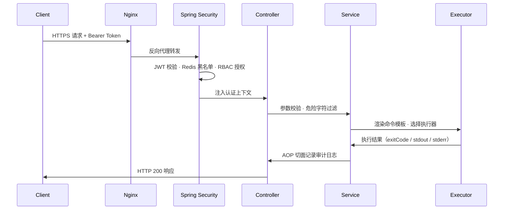
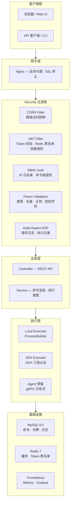
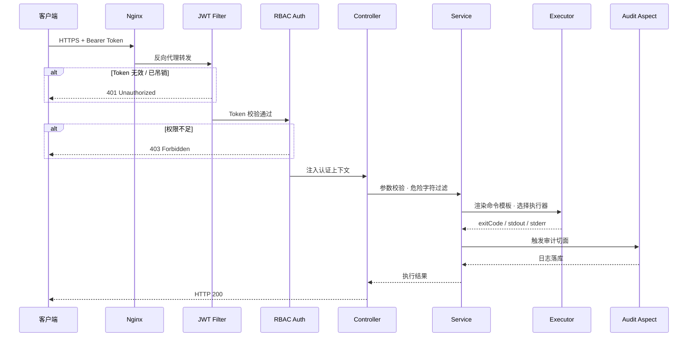
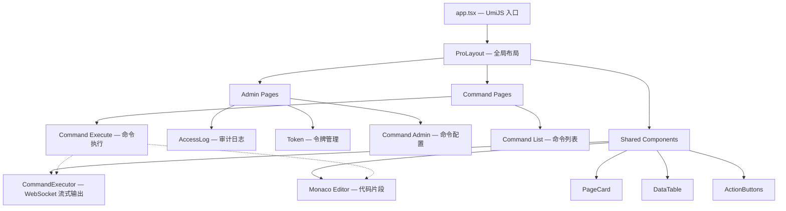

# HttpRun Java 架构设计文档

## 项目简介

HttpRun Java 是基于 [httprun 项目](https://github.com/raojinlin/httprun) 的 Java 企业级改写版本，面向企业的安全 Shell 命令网关。支持通过 RESTful API 或 Web UI 远程安全执行预定义命令，具备细粒度权限、审计、监控等特性。

---

## 技术栈

| 层次 | 核心技术 |
|------|---------|
| **后端** | Java 17 · Spring Boot 3.2 · Spring Security 6 · Spring Data JPA |
| **存储** | MySQL 8.0（主存储）· Redis 7（缓存 / Token 黑名单）|
| **安全** | JWT · AES-GCM 256位加密 · JSch（SSH 远程执行）|
| **运维** | Docker 多阶段构建 · Flyway 数据库迁移 · Prometheus + Grafana 监控 |
| **前端** | React 18 · TypeScript · Ant Design 5 · UmiJS · Monaco Editor |

---

## 目录结构

```
httprun-java/
├── src/main/java/com/httprun/
│   ├── config/       # 安全、JWT、异步等配置
│   ├── controller/   # REST API 控制器
│   ├── service/      # 业务逻辑层
│   ├── repository/   # JPA 数据访问层
│   ├── executor/     # 命令执行引擎（本地 / SSH / Agent）
│   ├── security/     # JWT 鉴权、IP 白名单、权限过滤器
│   └── aspect/       # 审计日志切面（AOP）
├── src/main/resources/
│   └── db/migration/ # Flyway 迁移脚本（V1–V6）
├── webapp/           # React 前端（Ant Design Pro）
│   ├── src/components/   # PageCard · DataTable · Executor · Editor
│   └── src/pages/        # Admin / Command / Token / AccessLog
└── docker/           # Dockerfile · docker-compose.yml
```

---

## 核心架构

### 1. 整体分层

```
┌─────────────────────────────────────┐
│          客户端层（浏览器 / API）      │
└────────────────┬────────────────────┘
                 │ HTTPS
┌────────────────▼────────────────────┐
│        Nginx（反向代理 / SSL 终止）    │
└────────────────┬────────────────────┘
                 │
┌────────────────▼────────────────────┐
│          Spring Security 过滤链       │
│  CORS → JWT 校验 → RBAC 授权 → 审计  │
└────────────────┬────────────────────┘
                 │
┌────────────────▼────────────────────┐
│     Controller → Service → Executor  │
│    本地执行 / SSH 执行 / Agent（预留）  │
└────────────────┬────────────────────┘
                 │
┌───────┬────────▼────────┬───────────┐
│ MySQL │      Redis      │ Prometheus │
└───────┴─────────────────┴───────────┘
```

### 2. API 执行全链路


```mermaid
sequenceDiagram
    participant Client
    participant Nginx
    participant Security as Spring Security
    participant Controller
    participant Service
    participant Executor

    Client->>Nginx: HTTPS 请求 + Bearer Token
    Nginx->>Security: 反向代理转发
    Security->>Security: JWT 校验 · Redis 黑名单 · RBAC 授权
    Security->>Controller: 注入认证上下文
    Controller->>Service: 参数校验 · 危险字符过滤
    Service->>Executor: 渲染命令模板 · 选择执行器
    Executor->>Service: 执行结果（exitCode / stdout / stderr）
    Service->>Controller: AOP 切面记录审计日志
    Controller->>Client: HTTP 200 响应
```

---

## 关键设计决策

### 安全体系

- **认证**：JWT + Redis 黑名单（支持主动吊销）+ 设备指纹绑定
- **授权**：RBAC 角色模型，支持命令级细粒度授权
- **参数安全**：危险字符白名单过滤 + 类型/长度/正则多层校验
- **凭证加密**：SSH 密码与私钥使用 AES-GCM 256位加密存储，API 返回时自动脱敏

### 命令执行引擎

| 模式 | 实现 | 说明 |
|------|------|------|
| Local | ProcessBuilder | 在网关服务器本地执行 |
| SSH | JSch | 三级认证：私钥 → 系统密钥 → 密码 |
| Agent | gRPC（预留）| 跨网络分布式执行 |

- 命令模板采用 `{{.var}}` 语法渲染参数
- 并发控制（Semaphore）+ 超时强杀 + 队列满保护

### 审计与可观测性

- **访问日志**：AOP 切面自动记录命令执行及写操作（过滤 GET）
- **执行历史**：服务端统一存储，支持多条件筛选、分页、按角色隔离
- **监控**：Micrometer → Prometheus → Grafana，`/actuator/health` 健康端点
- **审批流**：PENDING → APPROVED/REJECTED → EXECUTED 全链路状态机

### 前端设计系统

- **主题**：Dark OLED 黑底 + 品牌绿 `#10B981`，支持亮/暗双主题切换
- **字体**：Fira Code（代码）+ Fira Sans（界面）
- **组件**：PageCard · DataTable · ActionButtons · CommandExecutor · TokenSetting 统一规范

---

## 部署架构

```
docker-compose
  ├── httprun   :8081  （Spring Boot + React 静态资源）
  ├── mysql     :3306  （持久化存储）
  └── redis     :6379  （缓存 / 会话）
```

详细部署说明见 [docs/BUILD.md](docs/BUILD.md)。

---

## 架构图

### 系统整体架构


```mermaid
graph TB
    subgraph L1["客户端层"]
        Browser["浏览器 / Web UI"]
        ApiClient["API 客户端 / CLI"]
    end
    subgraph L2["网关层"]
        Nginx["Nginx — 反向代理 · SSL 终止"]
    end
    subgraph L3["Security 过滤链"]
        CORS["CORS Filter<br/>跨域访问控制"]
        JWT["JWT Filter<br/>Token 校验 · Redis 黑名单 · 设备指纹"]
        RBAC["RBAC Auth<br/>IP 白名单 · 命令级授权"]
        Param["Param Validation<br/>类型 · 长度 · 正则 · 危险字符"]
        AuditAOP["Audit Aspect AOP<br/>请求日志 · 执行记录"]
    end
    subgraph L4["业务层"]
        Ctrl["Controller — REST API"]
        Svc["Service — 命令渲染 · 执行调度"]
    end
    subgraph L5["执行层"]
        Local["Local Executor<br/>ProcessBuilder"]
        SSH["SSH Executor<br/>JSch 三级认证"]
        Agent["Agent 预留<br/>gRPC 分布式"]
    end
    subgraph L6["基础设施"]
        MySQL["MySQL 8.0<br/>命令 · 令牌 · 日志"]
        Redis["Redis 7<br/>缓存 · Token 黑名单"]
        Prom["Prometheus<br/>Metrics · Grafana"]
    end

    L1 --> L2 --> L3 --> L4 --> L5 --> L6
```

### API 执行链路


```mermaid
sequenceDiagram
    participant Client as 客户端
    participant Nginx
    participant JWT as JWT Filter
    participant RBAC as RBAC Auth
    participant Ctrl as Controller
    participant Svc as Service
    participant Exec as Executor
    participant AOP as Audit Aspect

    Client->>Nginx: HTTPS + Bearer Token
    Nginx->>JWT: 反向代理转发
    alt Token 无效 / 已吊销
        JWT-->>Client: 401 Unauthorized
    end
    JWT->>RBAC: Token 校验通过
    alt 权限不足
        RBAC-->>Client: 403 Forbidden
    end
    RBAC->>Ctrl: 注入认证上下文
    Ctrl->>Svc: 参数校验 · 危险字符过滤
    Svc->>Exec: 渲染命令模板 · 选择执行器
    Exec-->>Svc: exitCode / stdout / stderr
    Svc->>AOP: 触发审计切面
    AOP-->>Svc: 日志落库
    Svc-->>Ctrl: 执行结果
    Ctrl-->>Client: HTTP 200
```

### 前端组件架构


```mermaid
graph TD
    App["app.tsx — UmiJS 入口"] --> Layout["ProLayout — 全局布局"]

    Layout --> AdminPages["Admin Pages"]
    Layout --> CmdPages["Command Pages"]
    Layout --> Shared["Shared Components"]

    AdminPages --> AccessLog["AccessLog — 审计日志"]
    AdminPages --> TokenMgmt["Token — 令牌管理"]
    AdminPages --> CmdAdmin["Command Admin — 命令配置"]

    CmdPages --> CmdList["Command List — 命令列表"]
    CmdPages --> CmdExec["Command Execute — 命令执行"]

    Shared --> PageCard["PageCard"]
    Shared --> DataTable["DataTable"]
    Shared --> ActionButtons["ActionButtons"]
    Shared --> MonacoEditor["Monaco Editor — 代码片段"]
    Shared --> Executor["CommandExecutor — WebSocket 流式输出"]

    CmdExec -.-> Executor
    CmdExec -.-> MonacoEditor
```
